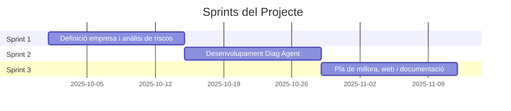

# Cybershield Solutions — Diag Agent


**Automatització d'Auditories i Pla de Millora**

**Autor**: Vitaliy Domin  
**Professors**: Marc Fuertes, Victor Manuel Cid, José Diego Cervellera  
**Assignatura**: 0379 Projecte Intermodular d'Administració de Sistemes Informàtics en Xarxa

---

## Índex

- [Introducció](#introducció)
- [1. Context del Projecte](#1-context-del-projecte)
- [2. Metodologia SCRUM](#2-metodologia-scrum)
- [3. Empresa Auditada](#3-empresa-auditada)
- [4. Anàlisi de Riscos](#4-anàlisi-de-riscos)
- [5. Desenvolupament Tècnic](#5-desenvolupament-tècnic)
  - [5.1. Arquitectura del Diag Agent](#51-arquitectura-del-diag-agent)
  - [5.2. Mòduls de Seguretat](#52-mòduls-de-seguretat)
  - [5.3. Pentest Agent (Nou)](#53-pentest-agent-nou)
  - [5.4. SOC Dashboard](#54-soc-dashboard)
  - [5.5. API REST i Integracions](#55-api-rest-i-integracions)
- [6. Setup i Desplegament](#6-setup-i-desplegament)
- [7. Website](#7-website)
- [8. Manual d'Usuari](#8-manual-dusuari)
- [9. Signatura Digital](#9-signatura-digital)
- [10. Hardening i Seguretat](#10-hardening-i-seguretat)
- [11. Conclusions i Futures Millores](#11-conclusions-i-futures-millores)

---

## Introducció

Dins del segon curs del cicle formatiu d'Administració de Sistemes Informàtics en Xarxa (ASIX), amb el perfil de Ciberseguretat, s'ha desenvolupat un projecte intermodular que simula una empresa real d'auditoria de seguretat informàtica.

L'objectiu principal és crear **Cybershield Solutions, S.L.**, una empresa que ofereix:
- Auditories de seguretat i anàlisi de vulnerabilitats
- Implementació de millores i reforç de seguretat (hardening)
- Desenvolupament d'eines pròpies com el **Diag Agent**

El cor del projecte és el desenvolupament d'una eina pròpia d'auditoria, programada en **Python** i amb una interfície web basada en **Flask**. Aquesta aplicació:
- Analitza processos, serveis, registres i vulnerabilitats
- Genera informes automàtics en format **PDF** (amb signatura digital) i **CSV**
- Ofereix un **SOC Dashboard** per monitoratge en temps real

> **Lema corporatiu**: *Protect · Detect · Secure*

---

## 1. Context del Projecte

### Cybershield Solutions, S.L.

L'empresa ha estat fundada per **Vitaliy Domin**, tècnic superior en ASIX amb especialització en Ciberseguretat.

**Estructura de l'empresa:**
- Àgil i flexible
- Adaptable a projectes de diferent abast
- Ús d'eines de codi obert
- Metodologies automatitzades
- Entorns virtualitzats

**Línies de servei principals:**

| Servei | Descripció |
|--------|------------|
| **Auditories** | Seguretat i anàlisi de vulnerabilitats en servidors i cloud |
| **Hardening** | Implementació de millores basades en conclusions d'auditories |
| **Eines pròpies** | Desenvolupament del Diag Agent |

---

## 2. Metodologia SCRUM

El projecte s'ha desenvolupat seguint la metodologia **SCRUM**.

### 2.1. Rols de l'Equip

| Rol | Responsable | Funcions |
|-----|-------------|----------|
| **Product Owner** | Vitaliy Domin | Definir objectius i prioritats |
| **Scrum Master** | Vitaliy Domin | Garantir el flux de treball |
| **Development Team** | Vitaliy Domin | Disseny, programació i documentació |

### 2.2. Organització de Tasques

S'ha utilitzat **NexusBoard** amb les columnes:
- **To Do**: Tasques pendents
- **In Progress**: Tasques en desenvolupament
- **Testing**: Tasques en revisió
- **Done**: Tasques finalitzades

### 2.3. Estructura dels Sprints



1. **Sprint 1**: Definició de l'empresa, anàlisi de riscos i contracte simbòlic
2. **Sprint 2**: Disseny i desenvolupament del Diag Agent
3. **Sprint 3**: Pla de millora, web i documentació final

---

## 3. Empresa Auditada

### Institut de l'Ebre

L'empresa auditada és l'**Institut de l'Ebre**, un centre educatiu de formació professional.

### 3.1. Infraestructura Tecnològica

- **2 servidors principals** en alta disponibilitat (HA)
- Sistema operatiu: **Linux Ubuntu Server LTS**
- **VLANs segmentades**: administració, professorat, alumnat, convidats

**Serveis allotjats:**
- Plataforma de gestió interna (bases de dades)
- Servidor web amb contingut docent
- Sistema d'autenticació LDAP
- Repositoris i arxius compartits
- Correu electrònic intern

### 3.2. Objectiu de l'Auditoria

- Verificar configuració de serveis crítics
- Detectar vulnerabilitats en paquets i serveis
- Analitzar registres i accessos fallits
- Avaluar bones pràctiques en gestió d'usuaris
- Generar informe tècnic automatitzat

### 3.3. Abast i Limitacions

> [!NOTE]
> L'auditoria és de tipus **preventiu i de diagnòstic**, sense accés a dades personals ni proves d'intrusió externa.

---

## 4. Anàlisi de Riscos

Basat en la metodologia de l'**INCIBE** (Institut Nacional de Ciberseguretat d'Espanya).

### 4.1. Actius Identificats

- Servidors Ubuntu en alta disponibilitat
- Sistemes d'autenticació LDAP
- Bases de dades acadèmiques
- Xarxa interna segmentada per VLANs
- Equips d'usuari final

### 4.2. Valoració del Risc

| Núm | Risc Identificat | Impacte | Probabilitat | Nivell | Mesura Preventiva |
|-----|------------------|---------|--------------|--------|-------------------|
| 1 | Vulnerabilitats en paquets obsolets | Alt | Mitjà | **Alt** | Actualitzacions automàtiques + Trivy |
| 2 | Accés no autoritzat per SSH | Alt | Baix | **Mitjà** | Limitació IP + claus SSH |
| 3 | Configuració insegura Apache/Nginx | Mitjà | Mitjà | **Mitjà** | Revisió TLS + Nmap vuln |
| 4 | Error humà gestió usuaris | Mitjà | Alt | **Alt** | Rotació contrasenyes |
| 5 | Fallada sistema HA | Alt | Baix | **Mitjà** | Monitoratge + proves failover |
| 6 | Absència còpies de seguretat | Alt | Mitjà | **Alt** | Còpies diàries + validació |

### 4.3. Conclusions

> [!IMPORTANT]
> Punts crítics identificats:
> - Dependència de disponibilitat dels servidors
> - Necessitat d'una política d'actualitzacions més estricta
> - Importància de monitorar accessos i processos sospitosos

---

## 5. Desenvolupament Tècnic

### 5.1. Arquitectura del Diag Agent

El fitxer principal `diag_agent_single.py` (~6.715 línies) està dissenyat com una solució **monolítica i portàtil** ("single-file agent"), ara complementat per l'agent especialitzat `pentest_agent.py` (~3.141 línies).

```
┌─────────────────────────────────────────────────────────────┐
│              DIAG AGENT & PENTEST SUITE v2026               │
├─────────────────────────────────────────────────────────────┤
│  ┌──────────────┐  ┌──────────────┐  ┌──────────────┐      │
│  │   Frontend   │  │   Backend    │  │   Parsers    │      │
│  │  Bootstrap 5 │  │    Flask     │  │  SSH/Nmap    │      │
│  │  Chart.js    │  │   psutil     │  │  Enum4linux  │      │
│  └──────────────┘  └──────────────┘  └──────────────┘      │
│                                                             │
│  ┌──────────────┐  ┌──────────────┐  ┌──────────────┐      │
│  │ SOC Dashboard│  │   Reports    │  │    API       │      │
│  │  Real-time   │  │  PDF/CSV     │  │  Telegram    │      │
│  │   Metrics    │  │ WeasyPrint   │  │  Hardened    │      │
│  └──────────────┘  └──────────────┘  └──────────────┘      │
└─────────────────────────────────────────────────────────────┘
```

**Components principals:**

| Component | Tecnologia | Funció |
|-----------|------------|--------|
| **Backend** | Python 3 + Flask | Gestió rutes HTTP, execució comandes i pentesting |
| **Frontend** | Bootstrap 5 + JS | Interfície web amb mode fosc i protecció XSS |
| **Monitoratge** | Chart.js + psutil | Gràfiques CPU/Memòria/Xarxa en temps real |
| **Reports** | WeasyPrint + Telegram | Generació PDF i enviament via bot de Telegram |

### 5.2. Mòduls de Seguretat

#### Scanner de Vulnerabilitats (Trivy)

```python
class SSHAuditReport:
    banner: str
    software: str
    kex_secure: List[SSHAlgorithm]
    kex_weak: List[SSHAlgorithm]
    critical_issues: List[str]
    hardening_actions: List[str]
```

- Analitza sistema de fitxers per detectar CVEs
- Filtra per severitat: CRITICAL, HIGH, MEDIUM
- Omit directoris temporals per optimitzar

#### Auditoria de Xarxa (Nmap)

```python
class NmapParser:
    DANGEROUS_PORTS = {
        21: "FTP - Unencrypted file transfer",
        23: "Telnet - Unencrypted remote access",
        445: "SMB - Windows shares",
        3389: "RDP - Remote Desktop"
    }
```

- Escaneig de ports TCP segur
- Validació d'arguments (sanitization)
- Només flags segurs: `-sV`, `-Pn`, `-T4`
- Límit de 250.000 caràcters de sortida

#### Auditoria SSH (SSH-Audit)

```python
class SSHAuditParser:
    FAIL_PATTERNS = [
        r'\(fail\)',
        r'weak\s+\(',
        r'broken', 
        r'vulnerable',
        r'SHA-?1',
        r'MD5'
    ]
```

- Analitza configuració SSH del servidor
- Detecta xifrats febles i claus obsoletes
- Genera recomanacions de hardening

#### Enumeració SMB (Enum4Linux)

- Audita servidors Samba
- Extreu usuaris, grups, shares
- Suport per enum4linux-ng (Python)

### 5.3. Pentest Agent (Nou)

S'ha integrat un potent motor de pentesting web (`pentest_agent.py`) que permet auditar aplicacions web per detectar:

- **SQL Injection**: Proves cegues i basades en errors.
- **Cross-Site Scripting (XSS)**: Detecció de reflexió en paràmetres i formularis.
- **Path Traversal / LFI**: Accés no autoritzat a fitxers locals.
- **CORS Misconfiguration**: Anàlisi de polítiques de compartició d'orígens.
- **Security Headers**: Verificació de CSP, HSTS, X-Frame-Options, etc.
- **Sensitive File Discovery**: Detecció de fitxers exposats (.env, config.php, backup.sql)

**Noves característiques (v2026):**

| Característica | Descripció |
|---------------|------------|
| **ExplanationDatabase** | Explicacions professionals per a cada tipus de vulnerabilitat |
| **FindingStatus** | Classificació intel·ligent (CONFIRMED, ENUMERATED, ACCESS_CONTROLLED, NOT_FOUND) |
| **Unified PDF** | Mateixa generació per descàrrega i Telegram |
| **2-Row Layout** | Nova taula de findings amb URL + explicació en fila separada |
| **Status Legend** | Definició d'estats a cada informe PDF |
| **Overall Assessment** | Avaluació automàtica de la postura de seguretat |
| **404 Appendix** | 404s separats en Appendix (no compten com a vulnerabilitats) |

**Exemple de classificació estricta:**
- 404 Not Found → Mou a Appendix (NO és vulnerabilitat)
- 200 OK + HTML genèric → `NOT_EXPOSED` (Filtra SPA catch-all)
- 200 OK + contingut sensible → `CONFIRMED` (CRITICAL/HIGH)
- 403/401 → `ACCESS_CONTROLLED` (INFO)
- 301/302 → `REDIRECTED` (INFO)

**Exemple de flux d'auditoria:**
1. **Crawling**: Descobriment recursiu de rutes i paràmetres.
2. **Fuzzing**: Enviament de payloads de seguretat.
3. **Anàlisi**: Verificació de respostes i evidències en el contingut.

### 5.4. SOC Dashboard

El Centre d'Operacions de Seguretat ofereix monitoratge en temps real:

```python
# Store metric history (last 60 data points)
soc_history = {
    "cpu": deque(maxlen=60),
    "memory": deque(maxlen=60),
    "disk": deque(maxlen=60),
    "network_sent": deque(maxlen=60),
    "network_recv": deque(maxlen=60),
    "timestamps": deque(maxlen=60)
}
```

**Funcions principals:**

| Funció | Descripció |
|--------|------------|
| `soc_get_system_metrics()` | CPU, Memòria, Disc, Uptime amb alertes |
| `soc_get_network_metrics()` | Tràfic de xarxa, connexions actives |
| `soc_get_security_events()` | SSH fails, processos sospitosos |
| `soc_get_critical_logs()` | Logs crítics del sistema |

**Detecció de processos sospitosos:**
- Executables fora de rutes del sistema
- Noms ocults o amb caràcters estranys
- Processos root des de /home o /tmp
- Processos escoltant en ports no estàndard

### 5.5. API REST i Integracions

L'agent exposa una API RESTful segura i s'integra amb serveis de missatgeria:

| Endpoint | Mètode | Descripció |
|----------|--------|------------|
| `/api/status` | GET | Estat general del sistema |
| `/api/pentest/start` | POST | Llança un escaneig amb el Pentest Agent |
| `/api/pentest/telegram/<id>`| POST | Envia informe PDF al teu Chat ID personal |
| `/api/nmap_scan` | POST | Llança escaneig Nmap segur |
| `/api/sshaudit` | POST | Executa auditoria SSH detallada |
| `/api/report/generate` | POST | Genera informes PDF signats |

**Integració amb Telegram:**
L'usuari pot introduir el seu **Chat ID** directament a la interfície per rebre l'auditoria a l'instant. L'agent inclou un bot actiu: només cal enviar-li el comandament `/start` per obtenir el teu ID de manera automàtica.

**Exemple d'ús:**

```javascript
// Obtenir estat del sistema
fetch('/api/status')
  .then(r => r.json())
  .then(data => {
    console.log('Vulnerabilitats:', data.vulns);
    console.log('CPU:', data.cpu + '%');
    console.log('Memòria:', data.memory + '%');
  });
```

---

## 6. Setup i Desplegament

### Script d'Instal·lació (`setup_diag.sh`)

El script automatitza completament la instal·lació:

```bash
#!/usr/bin/env bash
set -euo pipefail

# Directori on es troba l'script
SCRIPT_DIR="$(cd "$(dirname "$0")" && pwd)"
DIAG_PY="${SCRIPT_DIR}/diag_agent_single.py"
VENV_DIR="${SCRIPT_DIR}/venv"
```

### Dependències del Sistema

```bash
PKGS=(
    python3
    python3-pip
    python3-venv
    python3-dev
    build-essential
    curl jq git
    nmap
    ssh-audit
    smbclient
    samba-common-bin
    libpango-1.0-0
    libpangocairo-1.0-0
    libcairo2
)
```

### Dependències Python

```bash
pip install flask psutil weasyprint impacket ldap3 pyyaml \
    pyhanko[crypto] cryptography pyhanko-certvalidator \
    requests urllib3 beautifulsoup4 googlesearch-python \
    google-api-python-client
```

### Certificats per Signatura Digital

El setup genera automàticament un certificat auto-signat:

```bash
# Genera clau privada
openssl genrsa -out "${CERT_DIR}/cybershield.key" 2048

# Genera certificat (vàlid 10 anys)
openssl req -new -x509 \
    -key "${CERT_DIR}/cybershield.key" \
    -out "${CERT_DIR}/cybershield.crt" \
    -days 3650 \
    -subj "/C=ES/ST=Barcelona/L=Barcelona/O=Cybershield Solutions/..."
```

### Servei Systemd

L'script crea un servei `diag-agent.service`:

```ini
[Unit]
Description=Diag Agent (no-auth) - portable version
After=network.target

[Service]
Type=simple
ExecStart=${VENV_DIR}/bin/python3 ${DIAG_PY} --host ${BIND_IP} --port ${PORT}
WorkingDirectory=${SCRIPT_DIR}
Restart=on-failure
User=root

[Install]
WantedBy=multi-user.target
```

### Pas a Pas

1. **Copiar fitxers** al servidor via USB o scp:
   ```bash
   scp setup_diag.sh diag_agent_single.py user@server:/tmp/
   ```

2. **Assignar permisos**:
   ```bash
   chmod +x setup_diag.sh diag_agent_single.py
   ```

3. **Executar instal·lació**:
   ```bash
   sudo ./setup_diag.sh
   ```

4. **Accedir a la interfície**:
   ```
   http://<IP_SERVIDOR>:8080/
   ```

### Desinstal·lació

S'ha inclòs un script de desinstal·lació complet per netejar tots els components:

```bash
sudo ./uninstall_diag.sh
```

**Components eliminats:**
- Servei systemd (`diag-agent.service`)
- Entorn virtual Python (`venv/`)
- enum4linux-ng (directori clonat)
- Certificats digitals (`certs/`)
- Paquets APT opcionals (si es tria)
- Fitxers Python (si es tria desinstal·lació completa)

---

### Trivy Caching System (Nou v2026)

Per millorar el rendiment, s'ha implementat un sistema de caché global per a Trivy:

```python
TRIVY_CACHE = {}          # Diccionari global amb resultats
TRIVY_LOCK = threading.Lock()  # Protecció thread-safe

def refresh_trivy_cache():
    """Worker de fons: refresca la caché cada hora."""
    while True:
        with TRIVY_LOCK:
            TRIVY_CACHE['os'] = collect_trivy('os', force_refresh=True)
        time.sleep(3600)
```

**Beneficis:**

| Escenari | Abans | Després |
|----------|-------|---------|
| Primera càrrega | 30s | 30s |
| Següents càrregues | 30s | **0.001s** |
| Navegació entre pàgines | 30s | **0.001s** |

**Endpoint de refresc manual:**
```bash
curl -X POST http://localhost:8080/api/vulns/refresh
```

---

## 7. Website

El projecte inclou una **website corporativa** professional a la carpeta `Website/`.

### Estructura

```
Website/
├── index.html        # Pàgina principal (886 línies)
├── custom.css        # Estils personalitzats
├── custom.js         # Funcionalitats JavaScript
├── carousel.css      # Estils del carrusel
└── Assets/
    ├── logo.png
    ├── shield.png
    ├── foto.jpg
    ├── web.png
    └── Fotos Web/    # Captures del Diag Agent
```

### Seccions de la Web

| Secció | Descripció |
|--------|------------|
| **Hero** | Presentació i CTA principal |
| **Serveis** | Auditoria, Hardening, Monitoratge, Formació |
| **App** | Descripció del Diag Agent amb carrusel de captures |
| **Funcionalitats** | Detalls tècnics de cada mòdul |
| **Equip** | Presentació del fundador |
| **Sobre** | Història de Cybershield |
| **Tarifes** | Plans Start, Pro, Enterprise |
| **Contacte** | Formulari de contacte |
| **Notícies** | Blog tècnic |

### Tecnologies Utilitzades

- **HTML5** semàntic amb SEO
- **CSS3** amb variables i mode fosc
- **Bootstrap 5** per responsive design
- **Bootstrap Icons** per icones
- **Google Fonts** (Inter)
- **JavaScript** vainilla per interactivitat

### Política de Privacitat

La web inclou una modal amb:
- Privacitat RGPD
- Principis de seguretat
- Controls clau
- Alineació normativa
- Gestió d'incidents
- Auditories i millora contínua

---

## 8. Manual d'Usuari

### 8.1. Requisits Previs

- **Ubuntu Server** 20.04+ o 22.04 LTS
- Python 3.8+
- Eines externes: `nmap`, `trivy`, `ssh-audit`, `enum4linux`

### 8.2. Execució de l'Agent

```bash
sudo python3 diag_agent_single.py --host 0.0.0.0 --port 8080
```

O com a servei:
```bash
sudo systemctl start diag-agent
sudo systemctl status diag-agent
journalctl -u diag-agent -f  # Logs en directe
```

### 8.3. Navegació per la Interfície

| Pestanya | Funció |
|----------|--------|
| **Overview** | Dashboard amb KPIs principals |
| **Vulns** | Escaneig de vulnerabilitats Trivy |
| **Packages** | Paquets instal·lats i actualitzables |
| **Services** | Serveis i processos actius |
| **Logs** | Registres del sistema |
| **SSH Logs** | Fallades d'autenticació SSH |
| **Nmap** | Escaneig de ports de xarxa |
| **SSH Audit** | Auditoria de configuració SSH |
| **Enum4Linux** | Enumeració SMB/NetBIOS |
| **Pentest** | Auditories Web (SQLi, XSS, etc.) |
| **SOC Dashboard** | Monitoratge en temps real |
| **Report** | Generació i enviament (Telegram/PDF/CSV) |

### 8.4. Generació d'Informes

1. Anar a la pestanya **Report**
2. Seleccionar les seccions a incloure:
   - ☑️ Vulnerabilitats
   - ☑️ Nmap
   - ☑️ SSH Audit
   - ☑️ Logs
   - ☑️ Processos
3. Clicar **Genera PDF** o **Exporta CSV**
4. Opcionalment, introduir el **Chat ID** de Telegram i clicar **Send**.

---

## 9. Signatura Digital

Els informes PDF inclouen una **signatura digital** per garantir:
- ✅ Autenticitat del document
- ✅ Integritat (no modificat)
- ✅ No repudi


**Implementació amb PyHanko:**

```python
from pyhanko.sign import signers
from pyhanko.pdf_utils.incremental_writer import IncrementalPdfFileWriter

def sign_pdf_report(pdf_path, cert_path, key_path):
    # Carrega certificat i clau
    signer = signers.SimpleSigner.load(
        key_path, cert_path,
        key_passphrase=None
    )
    
    # Signa el PDF
    with open(pdf_path, 'rb+') as f:
        w = IncrementalPdfFileWriter(f)
        signers.sign_pdf(
            w, signers.PdfSignatureMetadata(
                field_name='CybershieldSignature',
                reason='Security Audit Report',
                location='Barcelona, Spain'
            ),
            signer=signer
        )
```

---

## 10. Hardening i Seguretat

S'han aplicat mesures rigoroses de seguretat per protegir l'eina ja que s'utilitza en entorns de diagnòstic:

- **Eliminació de RCE**: S'ha deshabilitat l'execució directa de comandaments arbitraris via API.
- **Protecció XSS**: Totes les dades que es mostren al Dashboard o informes (que poden provenir de resultats d'escanejos externs) són escapades tant al servidor (Python) com al client (JS).
- **Validació d'Inputs**: Ús de llistes blanques i `shlex` per garantir que les eines externes (`nmap`, `trivy`) només reben paràmetres segurs.

---

## 11. Conclusions i Futures Millores

### Conclusions

El projecte ha demostrat la viabilitat de crear una eina d'auditoria personalitzada i àgil utilitzant programari de codi obert.

**Punts forts:**
- Interfície web integrada i intuïtiva
- SOC Dashboard per monitoratge preventiu
- Informes PDF professionals amb signatura digital
- API segura amb validació d'arguments
- Desplegament automatitzat amb setup_diag.sh

### Futures Millores

| Millora | Descripció |
|---------|------------|
| **Autenticació** | Login per protegir l'accés al tauler |
| **Alertes** | Notificacions per email/Telegram en atacs |
| **Base de dades** | SQLite per històric d'auditories |
| **Docker** | Contenidor per desplegament fàcil |
| **Integració SIEM** | Export a Splunk/ELK |
| **Scanning programat** | Cronjobs per auditories automàtiques |

---

## Estructura del Projecte

```
Asix Diag/
├── diag_agent_single.py     # Agent principal (~6.715 línies)
├── pentest_agent.py         # Agent de Pentesting Web (~3.141 línies)
├── setup_diag.sh            # Script d'instal·lació
├── uninstall_diag.sh        # Script de desinstal·lació
├── cshield.png              # Logo Cybershield
├── portadafoto.png          # Imatge portada
├── Foto_SignaturaElectronica.png
├── DocumentacioProjecte@DominVitaliy.md
├── docs/                    # Documentació MkDocs
│   └── README.md            # Aquest fitxer
└── Website/
    ├── index.html
    ├── custom.css
    ├── custom.js
    ├── carousel.css
    └── Assets/
        ├── logo.png
        ├── shield.png
        ├── foto.jpg
        └── Fotos Web/
```

---

## Contacte

**Cybershield Solutions, S.L.**  
Tortosa (Tarragona)  
info@cybershield.local  
[LinkedIn](#) | [GitHub](#) | [Twitter/X](#)

---

*Documentació generada el Gener 2026*  
*Cybershield Solutions © 2026 — Professional Security Diagnostics*
