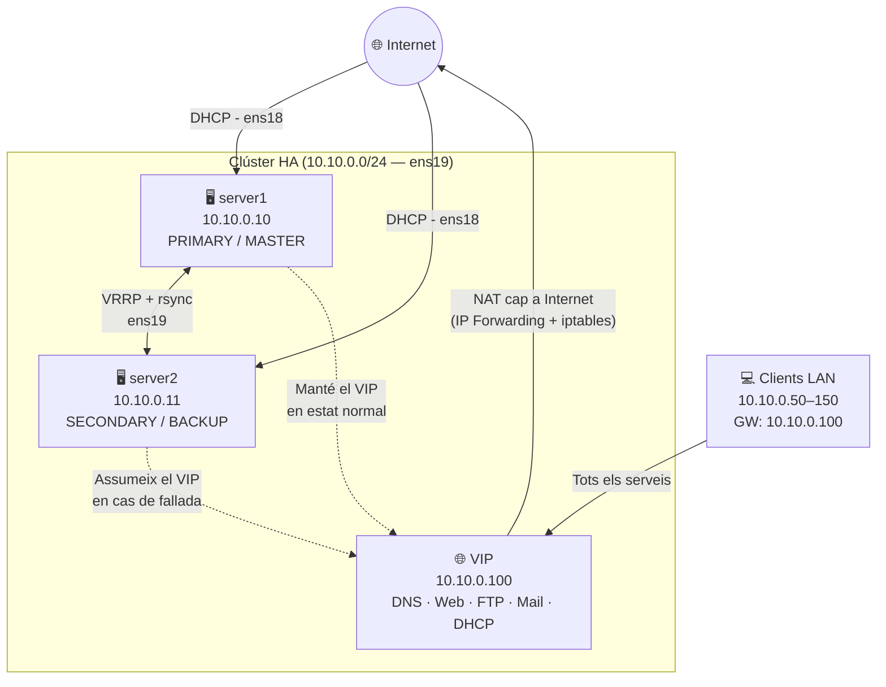
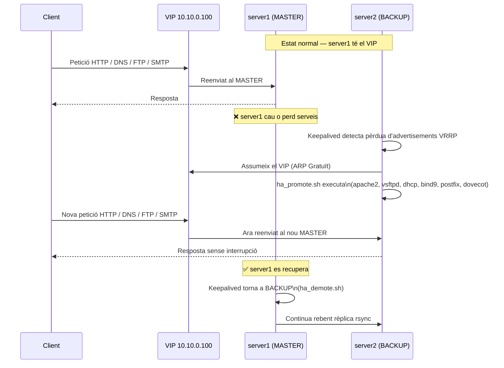
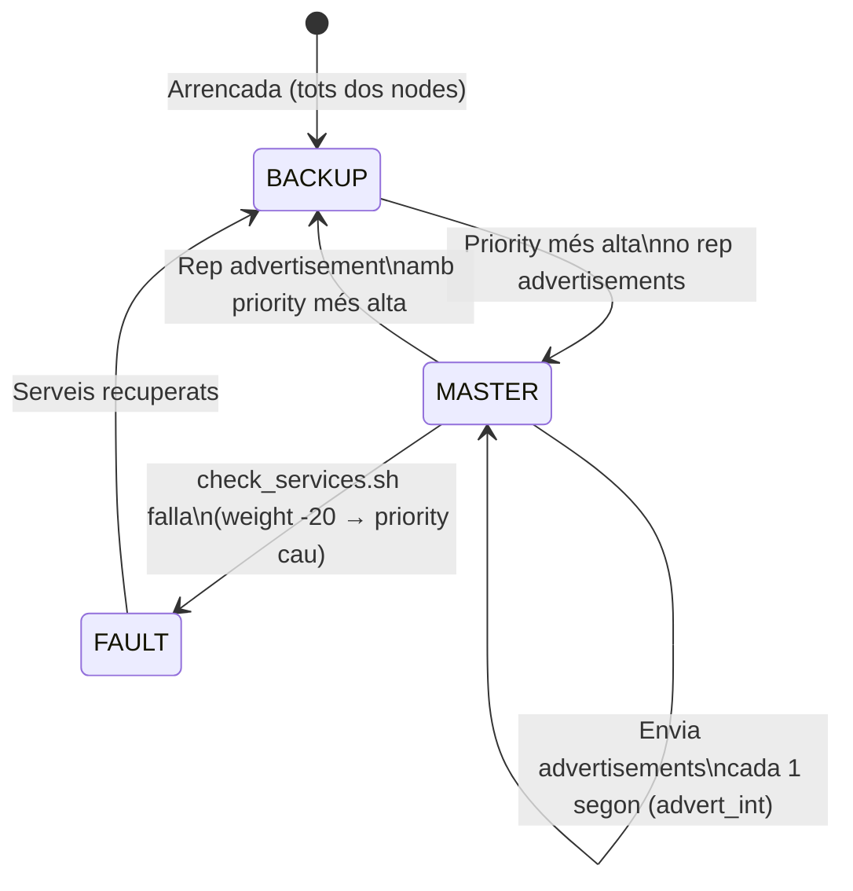
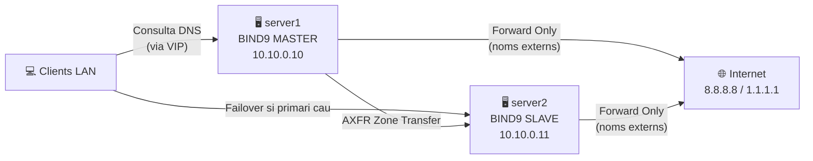
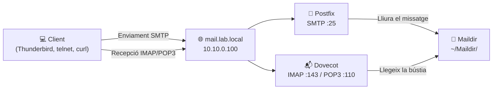
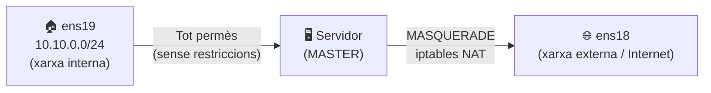
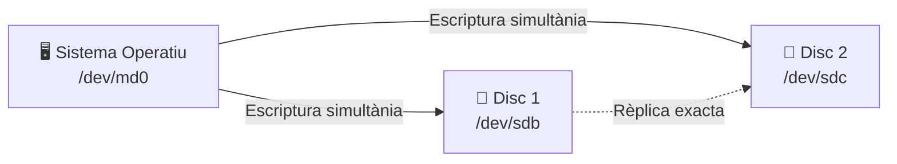

# Laboratori Alta Disponibilitat (HA) — Ubuntu Server

> **⚠️ AVÍS:** Aquesta configuració és **intencionadament vulnerable**. Només per a entorns de laboratori aïllats. Mai en producció.

---

## Visió general

Aquest laboratori desplega un clúster d'**Alta Disponibilitat** amb dos nodes Ubuntu Server. El node primari ofereix tots els serveis i el secundari els replica i espera. Si el primari cau, **Keepalived** cedeix automàticament la **IP Virtual (VIP)** al secundari, que assumeix tots els serveis sense interrupció perceptible.

Els nodes també actuen de **router NAT** per als clients de la xarxa interna, proporcionant accés a Internet a través de la interfície externa `ens18`.

| Paràmetre | Valor |
|---|---|
| Node primari | `server1.lab.local` — `10.10.0.10` |
| Node secundari | `server2.lab.local` — `10.10.0.11` |
| IP Virtual (VIP) | `vip.lab.local` — `10.10.0.100` |
| Domini | `lab.local` |
| Xarxa interna | `10.10.0.0/24` |
| Gateway clients (VIP) | `10.10.0.100` |
| DNS forwarders | `8.8.8.8`, `1.1.1.1` |
| Firewall | **Desactivat** (laboratori vulnerable) |

---

## Topologia de xarxa



> **Flux NAT:** els clients reben com a gateway la VIP (`10.10.0.100`). El node MASTER fa MASQUERADE del trànsit sortint per `ens18`, donant accés a Internet a tota la LAN interna.

---

## Flux de failover



---

## Xarxa — Netplan i NAT

Cada node té **dues interfícies**:

- `ens18` → xarxa externa (Internet), configurada per DHCP
- `ens19` → xarxa interna del clúster, IP estàtica

### Configuració Netplan (`/etc/netplan/99-ha-lab.yaml`)

```yaml
network:
  version: 2
  renderer: networkd
  ethernets:
    ens18:
      dhcp4: true
      dhcp6: false
    ens19:
      dhcp4: false
      dhcp6: false
      addresses:
        - 10.10.0.10/24          # IP estàtica del primari (10.10.0.11 al secundari)
      nameservers:
        addresses:
          - 10.10.0.10           # DNS primari
          - 10.10.0.11           # DNS secundari
        search:
          - lab.local
```

> **Nota:** El fitxer té permisos `600` (`chmod 600`) per exigència de `networkd`.

### NAT i IP Forwarding

Els nodes fan de **router** per als clients de la xarxa interna. S'activa durant la configuració de xarxa i persisteix entre reinicis gràcies a `iptables-persistent`.

```bash
# Activar IP Forwarding al kernel (persistent via sysctl.conf)
sysctl -w net.ipv4.ip_forward=1
# A /etc/sysctl.conf:
net.ipv4.ip_forward=1

# Regla NAT: tot el trànsit intern surt per ens18 amb MASQUERADE
iptables -t nat -A POSTROUTING -o ens18 -j MASQUERADE

# Guardar les regles per fer-les permanents
netfilter-persistent save
```


> **ip_nonlocal_bind=1** també s'activa perquè els serveis puguin fer bind a la VIP fins i tot abans que Keepalived l'assigni formalment.

---

## Alta Disponibilitat — Keepalived

**Keepalived** implementa el protocol **VRRP** (Virtual Router Redundancy Protocol) per gestionar la VIP entre els dos nodes. Utilitza mode **unicast** per evitar problemes en xarxes que no permeten multicast.

### Estats i transicions



### Configuració node primari (`/etc/keepalived/keepalived.conf`)

```nginx
global_defs {
    router_id server1_ha
    script_user root
    enable_script_security
}

vrrp_script chk_services {
    script "/etc/keepalived/check_services.sh"
    interval 5      # Comprova cada 5 segons
    timeout 3
    fall 2          # 2 fallades per canviar estat
    rise 2          # 2 èxits per tornar a MASTER
    weight -20      # Resta 20 de prioritat si falla
}

vrrp_instance VI_LAB {
    state MASTER           # Primari: MASTER | Secundari: BACKUP
    interface ens19
    virtual_router_id 51   # Ha de ser igual als dos nodes
    priority 150           # Primari = 150, Secundari = 100
    advert_int 1

    unicast_src_ip 10.10.0.10
    unicast_peer {
        10.10.0.11
    }

    authentication {
        auth_type PASS
        auth_pass LabHA123
    }

    virtual_ipaddress {
        10.10.0.100/24 dev ens19 label ens19:vip
    }

    track_script { chk_services }

    notify_master "/usr/local/bin/ha_promote.sh"
    notify_backup "/usr/local/bin/ha_demote.sh"
    notify_fault  "/usr/local/bin/ha_demote.sh"
}
```

### Script de comprovació de salut (`/etc/keepalived/check_services.sh`)

```bash
#!/bin/bash
systemctl is-active --quiet apache2 || exit 1
systemctl is-active --quiet vsftpd  || exit 1
systemctl is-active --quiet bind9   || exit 1
exit 0
```

> Si retorna `exit 1`, Keepalived resta **20 punts** al node (150 → 130), per sota del secundari (100), que aleshores pren el VIP.

---

## DNS — BIND9 amb Forwarding

El DNS segueix un model **primari/secundari**. El node primari manté les zones i el secundari les replica via AXFR. Tots dos reenvien consultes externes cap a Google i Cloudflare (`forward only`), permetent als clients de la LAN resoldre noms d'Internet.

### Arquitectura DNS



### Opcions globals (`/etc/bind/named.conf.options`)

```bind
options {
    directory "/var/cache/bind";
    recursion yes;
    allow-query    { any; };                        # Accepta consultes de tothom
    allow-recursion { 127.0.0.1; 10.10.0.0/24; };  # Recursió només a la LAN
    listen-on { any; };                             # Escolta a totes les IPs (inclosa VIP)
    allow-transfer { <IP_PEER>; };                  # Permet AXFR al node peer
    dnssec-validation auto;
    forwarders {
        8.8.8.8;    # Google DNS
        1.1.1.1;    # Cloudflare DNS
    };
    forward only;   # Reenviar SEMPRE als forwarders per noms externs
};
```

> **`forward only`** fa que BIND no intenti resoldre per Internet directament sinó que delega sempre als forwarders. Ideal per a laboratoris on el servidor no té resolució directa garantida.

### Zona directa (`/etc/bind/zones/db.lab.local`)

```bind
$TTL 86400
@   IN  SOA server1.lab.local. admin.lab.local. (
        2024010101  ; Serial (YYYYMMDDnn)
        3600        ; Refresh
        1800        ; Retry
        604800      ; Expire
        86400       ; Negative TTL
)

@       IN NS  server1.lab.local.
@       IN NS  server2.lab.local.

server1 IN A   10.10.0.10
server2 IN A   10.10.0.11
vip     IN A   10.10.0.100
web     IN A   10.10.0.100
ftp     IN A   10.10.0.100
mail    IN A   10.10.0.100
dvwa    IN A   10.10.0.100
ns1     IN A   10.10.0.10
ns2     IN A   10.10.0.11
gateway IN A   10.10.0.100        ; Gateway = VIP per HA
```

### Zona inversa (`/etc/bind/zones/db.10.10.0`)

```bind
$TTL 86400
@   IN  SOA server1.lab.local. admin.lab.local. (
        2024010101 3600 1800 604800 86400
)

@   IN NS server1.lab.local.
@   IN NS server2.lab.local.

10   IN PTR server1.lab.local.
11   IN PTR server2.lab.local.
100  IN PTR vip.lab.local.
```

### Verificació DNS

```bash
# Comprovar la configuració de BIND
named-checkconf
named-checkzone lab.local /etc/bind/zones/db.lab.local

# Resolució directa
dig @10.10.0.10 web.lab.local
dig @10.10.0.11 web.lab.local   # Ha de respondre igual (rèplica)

# Resolució inversa
dig @10.10.0.10 -x 10.10.0.100

# Provar resolució externa (forwarding cap a Internet)
dig @10.10.0.10 google.com

# Comprovar transferència de zona
dig @10.10.0.10 lab.local AXFR
```

---

## DHCP — ISC-DHCP-Server

El servidor DHCP **només s'executa al node MASTER**. Quan es produeix un failover, `ha_promote.sh` l'arrenca al nou master i `ha_demote.sh` l'atura a l'anterior.

Els clients reben la **VIP com a gateway** per garantir que el routing sempre passi pel node actiu, independentment de quin és el MASTER en cada moment.

### Configuració (`/etc/dhcp/dhcpd.conf`)

```dhcp
authoritative;
default-lease-time 3600;
max-lease-time 7200;

subnet 10.10.0.0 netmask 255.255.255.0 {
    range 10.10.0.50 10.10.0.150;

    option subnet-mask 255.255.255.0;
    option broadcast-address 10.10.0.255;
    option routers 10.10.0.100;              # VIP com a gateway (HA garantit)

    option domain-name "lab.local";
    option domain-name-servers               # DNS: primer el VIP, després cada node
        10.10.0.100,
        10.10.0.10,
        10.10.0.11;
}
```

> **Per què el gateway és la VIP?** Si el gateway fos la IP del primari (`10.10.0.10`) i aquest caigués, els clients perdrien el routing fins que renovessin el DHCP. Amb la VIP com a gateway, el routing continua sense interrupcions.

### Interfície d'escolta (`/etc/default/isc-dhcp-server`)

```bash
INTERFACESv4="ens19"    # Escolta només per la xarxa interna
```

### Verificació DHCP

```bash
cat /var/lib/dhcp/dhcpd.leases   # Concessions actives
systemctl status isc-dhcp-server
ss -ulnp | grep 67               # Comprova que escolta al port 67
```

---

## Web — Apache i PHP

Apache serveix la pàgina principal i un endpoint JSON d'estat per verificar quin node respon darrere el VIP.

### Pàgina d'estat (`/var/www/html/status.php`)

```php
<?php
header('Content-Type: application/json');
echo json_encode([
  'hostname'    => gethostname(),          // Mostra quin node respon
  'server_addr' => $_SERVER['SERVER_ADDR'],
  'time'        => date('c'),
  'uptime'      => trim(shell_exec('uptime -p')),
  'load'        => sys_getloadavg()
], JSON_PRETTY_PRINT);
```

Accedint a `http://10.10.0.100/status.php` podeu veure en temps real quin node respon.

### Configuració vulnerable (`/etc/apache2/conf-available/lab-vulnerable.conf`)

```apache
ServerTokens Full         # Exposa la versió completa d'Apache
ServerSignature On        # Mostra la versió a les pàgines d'error
TraceEnable On            # Permet HTTP TRACE (vulnerable a XST)
Header always unset X-Frame-Options
Header always unset X-Content-Type-Options
Header always unset Content-Security-Policy
```

---

## FTP — vsftpd

Configurat deliberadament de forma **insegura** per a pràctiques de seguretat.

### Configuració (`/etc/vsftpd.conf`)

```ini
listen=YES
listen_ipv6=NO

anonymous_enable=YES
local_enable=YES
write_enable=YES
anon_upload_enable=YES
anon_mkdir_write_enable=YES
anon_other_write_enable=YES

pasv_enable=YES
pasv_min_port=40000
pasv_max_port=40100

ssl_enable=NO

ftpd_banner=Welcome to HA-Lab vulnerable FTP
anon_root=/srv/ftp/public
```

> **Vulnerabilitats intencionals:** accés anònim amb escriptura, sense TLS, banner informatiu.

---

## Base de dades — MariaDB i DVWA

**DVWA** (Damn Vulnerable Web Application) per practicar SQL Injection, XSS, CSRF, etc.

### Usuaris de la base de dades

| Usuari | Contrasenya | Permisos |
|---|---|---|
| `root` | `labroot` | Local |
| `labuser` | `labpass` | Tots els privilegis, accés remot (`%`) |

### Accés a DVWA

```
http://dvwa.lab.local/dvwa/setup.php
```

Feu clic a **"Create / Reset Database"** i entreu amb `admin / password`.

### Verificació MariaDB

```bash
ss -tlnp | grep 3306                          # Comprova escolta en 0.0.0.0
mysql -h 10.10.0.100 -u labuser -plabpass dvwa # Connexió remota
```

---

## Correu — Postfix i Dovecot

El servidor de correu permet enviar i rebre missatges dins del domini `lab.local`. És accessible via la VIP (`mail.lab.local`). La configuració és **intencionadament insegura** (text pla, sense TLS) per a pràctiques de pentesting.

### Arquitectura



### Configuració Postfix (paràmetres clau)

```bash
myhostname    = mail.lab.local
mydestination = mail.lab.local, lab.local, localhost.localdomain, localhost
mynetworks    = 127.0.0.0/8, 10.10.0.0/24   # Relay permès des de la LAN
home_mailbox  = Maildir/                      # Format Maildir (un fitxer per missatge)
```

### Configuració Dovecot (paràmetres clau)

```bash
# /etc/dovecot/conf.d/10-auth.conf
disable_plaintext_auth = no    # Permet autenticació en text pla (lab vulnerable)

# /etc/dovecot/conf.d/10-mail.conf
mail_location = maildir:~/Maildir
```

### Verificació del correu

```bash
# Provar SMTP des de la línia de comandes
telnet mail.lab.local 25
  HELO test
  MAIL FROM:<labuser@lab.local>
  RCPT TO:<labuser@lab.local>
  DATA
  Subject: Test HA Lab
  Cos del missatge.
  .
  QUIT

# Comprovar que el missatge ha arribat
ls ~/Maildir/new/

# Comprovar serveis actius
systemctl status postfix dovecot
ss -tlnp | grep -E '25|143|110'
```

### Ports del correu

| Port | Protocol | Servei |
|---|---|---|
| 25 | TCP | SMTP (enviament) |
| 110 | TCP | POP3 (recepció) |
| 143 | TCP | IMAP (recepció) |

> **Nota HA:** El registre DNS `mail.lab.local` apunta al VIP. Si el primari cau, `ha_promote.sh` arrenca Postfix i Dovecot al secundari, que assumeix la bústia (si les dades estan sincronitzades via rsync).

---

## Sincronització — rsync i cron

El node primari sincronitza el contingut web i les zones DNS cap al secundari cada **5 minuts** mitjançant `rsync` sobre SSH.

### Script de sincronització (`/usr/local/bin/ha_sync.sh`)

```bash
#!/bin/bash
LOG="/var/log/ha_sync.log"
PEER="10.10.0.11"

sync_dir() {
    local src="$1"
    local dst="$2"
    rsync -az --delete \
      -e "ssh -o StrictHostKeyChecking=no -o ConnectTimeout=5" \
      "$src" "root@${PEER}:${dst}" >> "$LOG" 2>&1
}

sync_dir "/var/www/html/" "/var/www/html/"

# Primari: sincronitza zones DNS
sync_dir "/etc/bind/zones/" "/etc/bind/zones/"
```

### Cron del primari (`/etc/cron.d/ha_lab_sync`)

```cron
*/5 * * * * root /usr/local/bin/ha_sync.sh
```

> **Requisit:** La clau SSH de `root` del primari ha d'estar autoritzada al secundari. Veure [Instal·lació pas a pas](#installació-pas-a-pas).

---

## Firewall — Sense UFW (iptables NAT)

> **El laboratori funciona amb el firewall completament OBERT.** UFW es desactiva explícitament a l'inici del script. Totes les connexions entrants estan permeses per facilitar les pràctiques de seguretat.

L'únic ús d'`iptables` és per al **NAT** de la xarxa interna cap a Internet:



```bash
# L'única regla activa: NAT per donar Internet als clients
iptables -t nat -A POSTROUTING -o ens18 -j MASQUERADE

# UFW desactivat explícitament
ufw disable
```

### Ports accessibles (tots oberts)

| Port | Protocol | Servei |
|---|---|---|
| 22 | TCP | SSH |
| 25 | TCP | SMTP |
| 53 | TCP/UDP | DNS |
| 67/68 | UDP | DHCP |
| 80 | TCP | HTTP / DVWA |
| 110 | TCP | POP3 |
| 143 | TCP | IMAP |
| 21 | TCP | FTP |
| 40000–40100 | TCP | FTP mode passiu |
| 3306 | TCP | MariaDB |

---

## Scripts de promoció i retrocés

### Promoció a MASTER (`/usr/local/bin/ha_promote.sh`)

S'executa quan un node passa a ser MASTER (rep el VIP).

```bash
#!/bin/bash
systemctl start apache2         || true
systemctl start vsftpd          || true
systemctl start isc-dhcp-server || true
systemctl start bind9           || true
systemctl start postfix         || true
systemctl start dovecot         || true

echo MASTER > /var/run/keepalived_state
```

### Retrocés a BACKUP (`/usr/local/bin/ha_demote.sh`)

S'executa quan un node passa a BACKUP o FAULT.

```bash
#!/bin/bash
# Atura el DHCP (no han d'haver-hi dos DHCP actius simultàniament)
systemctl stop isc-dhcp-server || true

echo BACKUP > /var/run/keepalived_state
```

> **Per què no s'aturen tots els serveis?** Apache, vsftpd, DNS i correu es mantenen al BACKUP per si un client els consulta directament per IP. Només el DHCP és crític aturar-lo per evitar conflictes de xarxa.

---

## Instal·lació pas a pas

### 1. Copiar l'script als dos nodes

```bash
scp scriptserver.sh user@10.10.0.10:/tmp/
scp scriptserver.sh user@10.10.0.11:/tmp/
```

### 2. Executar al node primari

```bash
ssh user@10.10.0.10
sudo bash /tmp/scriptserver.sh
# Seleccionar opció [1] PRIMARI
```

### 3. Executar al node secundari

```bash
ssh user@10.10.0.11
sudo bash /tmp/scriptserver.sh
# Seleccionar opció [2] SECUNDARI
```

### 4. Intercanviar claus SSH entre nodes

```bash
# Des del primari
ssh-copy-id root@10.10.0.11

# Des del secundari
ssh-copy-id root@10.10.0.10
```

### 5. Reiniciar Keepalived als dos nodes

```bash
systemctl restart keepalived
```

### 6. Verificar que el primari té el VIP

```bash
ip addr show ens19 | grep 10.10.0.100
```

---

## Verificació del clúster

### Comprovar estat de Keepalived

```bash
ip addr show ens19 | grep 10.10.0.100   # Quin node té el VIP
journalctl -u keepalived -f              # Logs en temps real
cat /var/run/keepalived_state            # MASTER o BACKUP
```

### Simular una fallada

```bash
# Al node primari, aturar Apache per provocar el failover
systemctl stop apache2

# Observar al secundari com assumeix el VIP
journalctl -u keepalived -f

# Des d'un client, verificar que el servei continua disponible
curl http://10.10.0.100/status.php
# El camp "hostname" ha de mostrar ara "server2"
```

### Comprovar NAT i connectivitat a Internet

```bash
# Des d'un client de la LAN (GW: 10.10.0.100)
ping 8.8.8.8           # Connectivitat IP
curl https://google.com # Connectivitat HTTP/S
nslookup google.com 10.10.0.100  # DNS forwarding cap a Internet
```

### Comprovar sincronització

```bash
# Veure el log de rsync
tail -f /var/log/ha_sync.log

# Crear un fitxer al primari i verificar al secundari
echo "test HA" > /var/www/html/test.txt
/usr/local/bin/ha_sync.sh       # Sincronització manual
ssh root@10.10.0.11 cat /var/www/html/test.txt
```

### Comprovar el correu

```bash
# Estat dels serveis de correu
systemctl status postfix dovecot

# Ports escoltant
ss -tlnp | grep -E ':25|:110|:143'

# Enviar missatge de prova
echo "Test" | mail -s "HA Lab Test" labuser@lab.local
```

---

## RAID — Emmagatzematge redundant

> **Nota de disseny:** En un entorn de producció real, les dades dels usuaris residirien en un **NAS extern** (p.ex. TrueNAS, Synology) compartit entre els dos nodes via NFS o iSCSI, eliminant la necessitat de RAID local. En aquest laboratori es documenta la configuració de **RAID 1 por software** (`mdadm`) com a alternativa per a entorns sense NAS.

### Què és RAID 1?

RAID 1 (**mirror**) escriu les mateixes dades simultàniament a dos discos. Si un disc falla, el sistema continua funcionant amb l'altre sense pèrdua de dades.



| Característica | Valor |
|---|---|
| Nivell RAID | 1 (mirror) |
| Discos mínims | 2 |
| Capacitat útil | 50% (mida d'1 disc) |
| Tolerància a fallades | 1 disc |
| Redundància | Sí |
| Millora rendiment lectura | Sí (llegeix dels dos) |
| Millora rendiment escriptura | No |

### Prerequisits — Discos addicionals a la VM

Per al laboratori, afegiu **2 discos virtuals addicionals** a cada VM (a Proxmox, VMware o VirtualBox). En aquest exemple, els discos nous apareixen com `/dev/sdb` i `/dev/sdc`.

```bash
# Verificar que els discos estan disponibles i buits
lsblk
fdisk -l /dev/sdb /dev/sdc
```

### Instal·lació de mdadm

```bash
apt-get install -y mdadm
```

### Creació del RAID 1

```bash
# Crear el dispositiu RAID 1 amb els dos discos
mdadm --create /dev/md0 \
      --level=1 \
      --raid-devices=2 \
      /dev/sdb /dev/sdc

# Confirmar amb "y" quan ho demani
# La sincronització inicial pot trigar uns minuts
```

### Seguiment de la sincronització inicial

```bash
# Veure el progrés de la sincronització (resync)
cat /proc/mdstat

# Exemple de sortida:
# md0 : active raid1 sdc[1] sdb[0]
#       10476544 blocks super 1.2 [2/2] [UU]
#       [=========>...........]  resync = 47.9% finish=0.4min
```

### Formatar i muntar el RAID

```bash
# Crear el sistema de fitxers
mkfs.ext4 /dev/md0

# Crear el punt de muntatge (p.ex. per a dades d'usuaris)
mkdir -p /srv/raid

# Muntar manualment
mount /dev/md0 /srv/raid
```

### Muntatge automàtic en arrencada (`/etc/fstab`)

```bash
# Obtenir l'UUID del dispositiu RAID
blkid /dev/md0
# Exemple: /dev/md0: UUID="a1b2c3d4-..." TYPE="ext4"

# Afegir a /etc/fstab
echo "UUID=a1b2c3d4-xxxx-xxxx-xxxx-xxxxxxxxxxxx  /srv/raid  ext4  defaults  0  2" >> /etc/fstab

# Verificar que el fstab és correcte
mount -a
```

### Persistència de la configuració RAID

```bash
# Guardar la configuració de mdadm
mdadm --detail --scan >> /etc/mdadm/mdadm.conf

# Actualitzar initramfs per a detecció en arrencada
update-initramfs -u
```

### Verificació del RAID

```bash
# Estat detallat del RAID
mdadm --detail /dev/md0

# Exemple de sortida esperada:
#          State : clean
# Active Devices : 2
#  Failed Devices : 0
#    Array Size : 10476544 (9.99 GiB)
#  Used Dev Size : 10476544
#    Raid Level : raid1
# Availability : 4.00 GiB
#
# Number  Major  Minor  RaidDevice State
#    0      8      16       0      active sync  /dev/sdb
#    1      8      32       1      active sync  /dev/sdc

# Resum ràpid
cat /proc/mdstat
```

### Simular la fallada d'un disc

```bash
# Marcar /dev/sdb com a disc defectuós
mdadm /dev/md0 --fail /dev/sdb

# Verificar que el RAID continua actiu amb 1 disc
cat /proc/mdstat
# Ha de mostrar: [2/1] [_U] (un disc actiu, un de fallat)

# Treure el disc defectuós del RAID
mdadm /dev/md0 --remove /dev/sdb
```

### Substitució i reconstrucció del disc

```bash
# Afegir el disc nou (o el mateix un cop "reparat")
mdadm /dev/md0 --add /dev/sdb

# Seguir la reconstrucció
watch cat /proc/mdstat
```

### Integració amb els serveis del laboratori

Per usar el RAID per a les dades dels usuaris (bústies de correu, web, FTP):

```bash
# Moure les dades web al RAID
mv /var/www/html /srv/raid/html
ln -s /srv/raid/html /var/www/html

# Moure les bústies de correu al RAID (per a tots els usuaris)
# Heu de configurar Postfix per usar /srv/raid/mail
postconf -e "home_mailbox = /srv/raid/mail/"

# Moure el FTP al RAID
mv /srv/ftp /srv/raid/ftp
ln -s /srv/raid/ftp /srv/ftp
```

> **Avantatge enfront del NAS:** El RAID local no depèn de xarxa i és més simple de configurar en un laboratori aïllat. L'**inconvenient** és que la redundància és *local* a cada node, no compartida: si el primari cau completament (no sols una fallada de disc), les dades del secundari poden estar desincronitzades respecte a les del primari (és per això que en producció s'usa un NAS compartit).

---

## Resum de serveis i ports

| Port | Protocol | Servei | Node actiu |
|---|---|---|---|
| 22 | TCP | SSH | Ambdós |
| 25 | TCP | SMTP (Postfix) | MASTER (+ BACKUP passiu) |
| 53 | TCP/UDP | DNS (BIND9) | Ambdós (M=master, B=slave) |
| 67/68 | UDP | DHCP | Només MASTER |
| 80 | TCP | HTTP / DVWA (Apache) | MASTER (+ BACKUP passiu) |
| 110 | TCP | POP3 (Dovecot) | MASTER (+ BACKUP passiu) |
| 143 | TCP | IMAP (Dovecot) | MASTER (+ BACKUP passiu) |
| 21 | TCP | FTP (vsftpd) | MASTER (+ BACKUP passiu) |
| 40000–40100 | TCP | FTP mode passiu | MASTER (+ BACKUP passiu) |
| 3306 | TCP | MariaDB | Ambdós |
