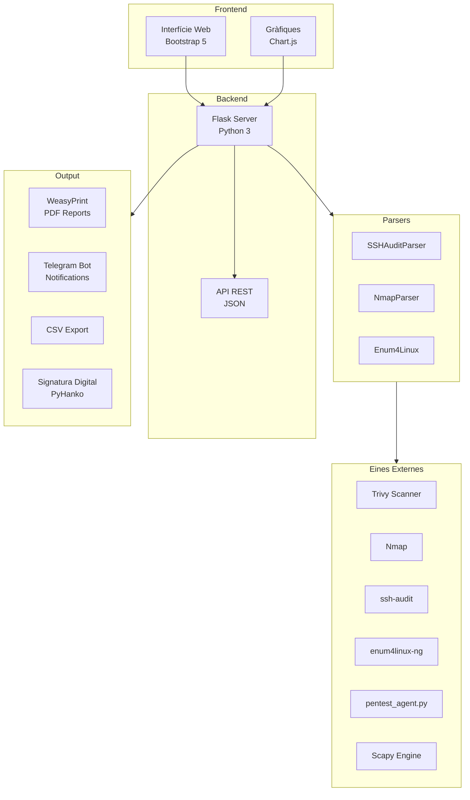
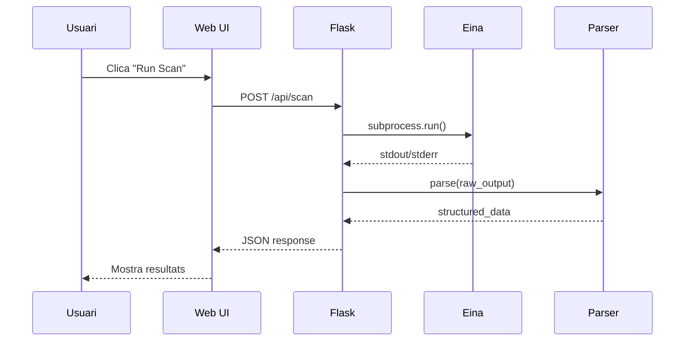
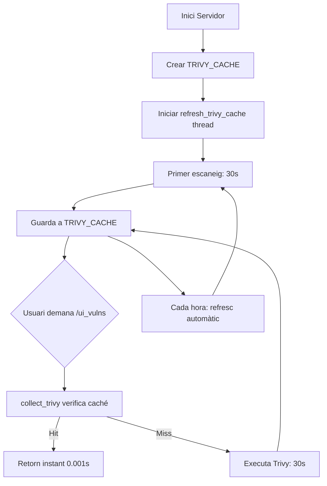

# Arquitectura del Diag Agent

El fitxer principal `diag_agent_single.py` (**~6.715 línies**) i el mòdul especialitzat `pentest_agent.py` (**~3.141 línies**) formen una solució **monolítica i modular** alhora per facilitar el desplegament en entorns auditats.

---

## Diagrama d'Arquitectura



---

## Components Principals

### Backend (Python 3 + Flask)

```python
app = Flask(__name__)

# Configuració globals
NMAP_BIN = shutil.which("nmap")
NMAP_TIMEOUT = 120
NMAP_MAX_CHARS = 250_000
```

| Responsabilitat | Implementació |
|-----------------|---------------|
| Gestió de rutes HTTP | `@app.route()` decorators |
| Execució de comandes | `subprocess.run()` amb timeouts |
| Processament de dades | Estructures `dataclass` |
| Restricció d'accés | `ALLOWED_NETWORKS` whitelist |

### Frontend (HTML + JavaScript)

El frontend està integrat dins el mateix fitxer Python utilitzant `render_template_string`:

```python
BASE_HTML = """
<!doctype html>
<html lang="en" data-theme="dark">
<head>
  <meta charset="utf-8">
  <link href="https://cdn.jsdelivr.net/npm/bootstrap@5.3.2/dist/css/bootstrap.min.css" rel="stylesheet">
  <link href="https://cdn.jsdelivr.net/npm/bootstrap-icons@1.11.3/font/bootstrap-icons.css" rel="stylesheet">
  <link href="https://fonts.googleapis.com/css2?family=Inter:wght@400;500;600;700&display=swap" rel="stylesheet">
  ...
</head>
"""
```

**Característiques:**
- Mode fosc per defecte
- Disseny responsive
- Tema professional "Cybersecurity"

### Parsers Professionals

Cada eina externa té el seu propi parser estructurat:

=== "SSHAuditParser"

    ```python
    @dataclass
    class SSHAlgorithm:
        name: str
        key_size: str = ""
        security_level: str = "unknown"
        notes: List[str] = field(default_factory=list)
    
    @dataclass
    class SSHAuditReport:
        banner: str = ""
        software: str = ""
        kex_secure: List[SSHAlgorithm]
        kex_weak: List[SSHAlgorithm]
        critical_issues: List[str]
        hardening_actions: List[str]
    ```

=== "NmapParser"

    ```python
    @dataclass
    class NmapPort:
        port: int
        protocol: str = "tcp"
        state: str = ""
        service: str = ""
        version: str = ""
        security_level: str = "unknown"
    
    @dataclass
    class NmapHost:
        ip: str
        hostname: str = ""
        ports: List[NmapPort]
    ```

---

## Seguretat Integrada

### Validació d'Arguments Nmap

```python
# Flags segurs permesos
SINGLE_TOKEN_WHITELIST = {"-p-", "-Pn", "-sV", "-v", "-vv", "-A"}
T_TUNING_RE = re.compile(r"^-T[0-5]$")

def validate_nmap_extra_args(tokens):
    """Rejects --script* and shell metachars"""
    for t in tokens:
        if "--script" in t.lower():
            return None, "Scripts not allowed"
        if re.search(r'[;&|`$(){}]', t):
            return None, "Shell metachar detected"
```

### Restricció de Xarxa

```python
ALLOWED_NETWORKS = []  # Per defecte, només localhost

@app.before_request
def restrict_client_ip():
    if not is_client_allowed(request.remote_addr):
        abort(403)
```

---

## Flux de Dades



---

## Estructura del Codi

| Línies | Descripció |
|--------|------------|
| 1-38 | Imports i configuració (ara inclou Scapy) |
| 39-623 | SSHAuditParser |
| 624-1053 | NmapParser |
| 1054-1150 | Seguretat (Hardening) i Helpers |
| 1151-1800 | UI HTML/CSS/JS (Protecció XSS) |
| 1801-1907 | SOC Dashboard Metrics |
| 1908-2022 | **Network IDS (Classe NetworkMonitor)** |
| 2023-2800 | Pentest Wrapper i API |
| 2801-7100+ | Report generation, Telegram, PDF signing i Caché de Trivy |

---

## Sistema de Caché de Trivy

Un dels problemes de rendiment més significatius del Diag Agent era el temps d'execució de **Trivy**. Cada escaneig de vulnerabilitats trigava **30+ segons**, la qual cosa impactava greument la usabilitat.

### Problema

```
[Usuari clica "Vulnerabilities"] → 30 segons d'espera → Resultats
[Usuari actualitza la pàgina]    → 30 segons d'espera → Mateixos resultats
```

### Solució: Caché Global amb Worker de Fons

**Arquitectura implementada:**



### Implementació

**Variables globals (diag_agent_single.py, línies ~150-170):**

```python
# Global Trivy cache
TRIVY_CACHE = {}          # Dict: {scan_type: result}
TRIVY_LOCK = threading.Lock()  # Thread-safe protection

def refresh_trivy_cache():
    """Background worker: refreshes Trivy cache every hour."""
    while True:
        with TRIVY_LOCK:
            TRIVY_CACHE['os'] = collect_trivy('os', force_refresh=True)
            TRIVY_CACHE['python'] = collect_trivy('python', force_refresh=True)
        time.sleep(3600)  # 1 hora
```

**Funció de recollida amb caché (~línies 200-250):**

```python
def collect_trivy(scan_type='os', force_refresh=False):
    """Collect Trivy scan results with caching support."""
    
    # 1. Check cache first (if not forcing refresh)
    if not force_refresh:
        with TRIVY_LOCK:
            if scan_type in TRIVY_CACHE:
                return TRIVY_CACHE[scan_type]  # INSTANT!
    
    # 2. Execute Trivy (slow: 30+ seconds)
    result = subprocess.run(
        ['trivy', 'fs', '--scanners', 'vuln', ...],
        capture_output=True,
        timeout=120
    )
    
    # 3. Parse and cache result
    parsed_data = parse_trivy_output(result.stdout)
    
    with TRIVY_LOCK:
        TRIVY_CACHE[scan_type] = parsed_data
    
    return parsed_data
```

**Endpoint per a refresc manual:**

```python
@app.route("/api/vulns/refresh", methods=["POST"])
def api_vulns_refresh():
    """Force Trivy cache refresh."""
    with TRIVY_LOCK:
        TRIVY_CACHE.clear()
    
    # Trigger immediate refresh
    collect_trivy('os', force_refresh=True)
    collect_trivy('python', force_refresh=True)
    
    return jsonify({"success": True, "message": "Cache refreshed"})
```

### Beneficis

| Escenari | Abans | Després | Millora |
|----------|-------|---------|--------|
| Primera càrrega | 30s | 30s | - |
| Actualitzar pàgina | 30s | 0.001s | **99.99%** |
| Navegació entre pàgines | 30s | 0.001s | **99.99%** |
| Refresc manual | N/A | 30s | Sota demanda |

### Thread Safety

El sistema fa servir `threading.Lock()` per evitar **race conditions**:

- **Sense Lock**: Dos threads podrien escriure a `TRIVY_CACHE` simultàniament → Dades corruptes
- **Amb Lock**: Només un thread pot accedir a `TRIVY_CACHE` a la vegada → Segur

```python
with TRIVY_LOCK:  # Bloqueja l'accés
    TRIVY_CACHE['os'] = result
# Desbloqueja automàticament en sortir del block
```

### Cicle de Vida

1. **Inici del servidor**: `refresh_trivy_cache()` s'inicia com a thread `daemon`
2. **Primer escaneig**: 30 segons (inevitable, Trivy és lent)
3. **Guardat a caché**: `TRIVY_CACHE['os'] = result`
4. **Següents peticions**: Lectura instant de memòria
5. **Cada hora**: Refresc automàtic de fons
6. **Manual**: Via `/api/vulns/refresh`

---

!!! tip "Single-File Design"
    El disseny monolític permet copiar un sol fitxer `.py` al servidor i executar-lo directament, sense dependències de fitxers externs (excepte les eines del sistema).
