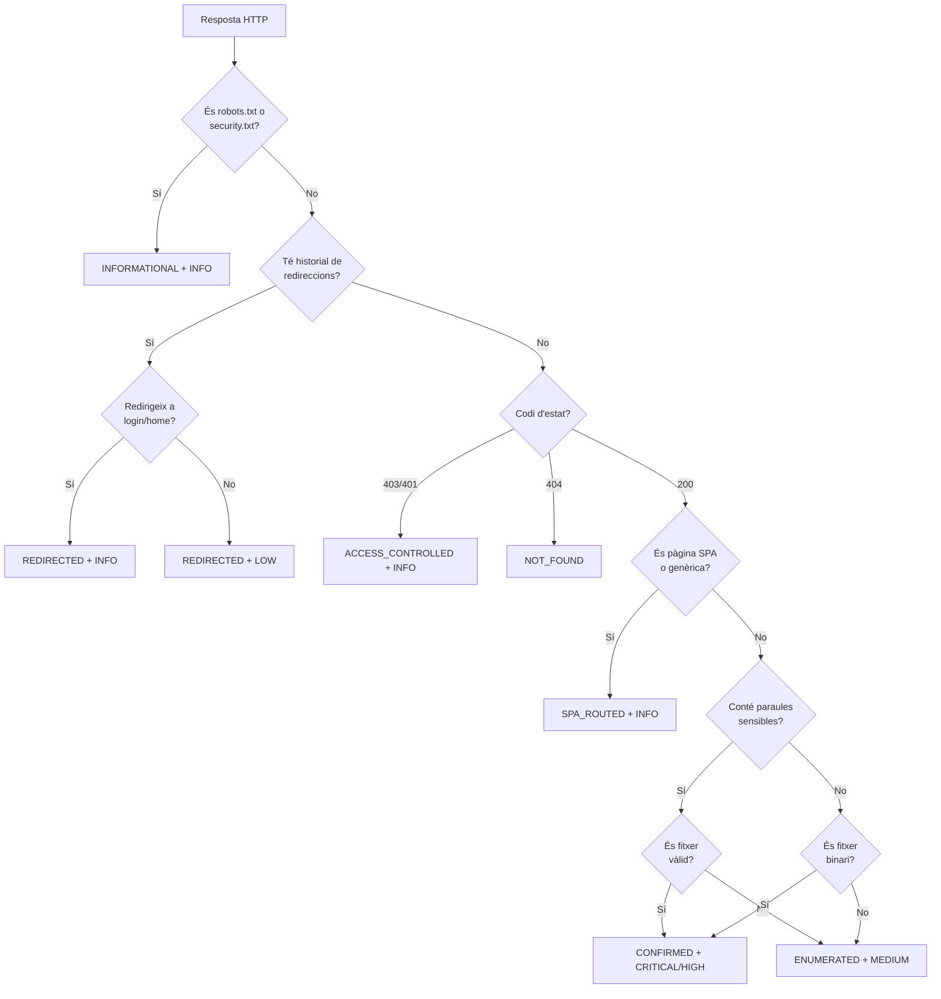

# Anàlisi Tècnica del Codi

Aquest document proporciona una anàlisi tècnica detallada de les parts més importants del Diag Agent, especialment del mòdul Pentest. És una guia per a professors i avaluadors que vulguin comprendre la **lògica interna** i les **decisions de disseny** del codi.

---

## Estructura del Projecte

```
Diag agent/
├── diag_agent_single.py   (~6.715 línies) - Servei web Flask amb SOC Dashboard
├── pentest_agent.py       (~3.141 línies) - Motor d'auditoria web
├── diagbot.py            (~3.274 línies) - Bot de Telegram
└── setup_diag.sh         ( ~137 línies) - Script d'instal·lació
```

---

## Classes Principals

### 1. `PentestAgent` (pentest_agent.py)

És la classe central del mòdul d'auditoria web. Gestiona tot el procés d'escaneig, des del crawling fins a la generació d'informes.

**Atributs clau:**
```python
class PentestAgent:
    def __init__(self, base_url, max_threads=10, max_requests=500):
        self.base_url = base_url
        self._findings = []           # Llista de descobertes
        self._visited_urls = set()    # URLs ja visitades (evita duplicats)
        self._stats = ScanStats()     # Estadístiques de l'escaneig
        self._not_found_paths = []    # Camins 404 (separats de findings)
        self._lock = Lock()           # Thread-safe per a concurrència
```

**Per què és important el Lock?**
- El PentestAgent usa `ThreadPoolExecutor` per fer múltiples peticions simultànies
- Sense el `Lock`, múltiples threads podrien modificar `_findings` al mateix temps
- Això causaria **race conditions** (resultats impredictibles)

**Mètodes principals:**

| Mètode | Línies | Funció |
|--------|--------|--------|
| `run()` | ~50 | Orquestració general: Crawl → Scan → Report |
| `_crawl_recursive()` | ~100 | Descobriment recursiu de rutes i formularis |
| `scan_sqli()` | ~200 | Detecció de SQL Injection (time-based, error-based, union-based) |
| `scan_xss()` | ~150 | Detecció de Cross-Site Scripting |
| `scan_sensitive_files()` | ~80 | Cerca de fitxers exposats (.env, config.php, etc.) |
| `_classify_exposure()` | ~75 | **Cervell del scanner** - Classifica respostes HTTP |
| `export_txt()` | ~50 | Generació d'informes TXT |
| `export_html()` | ~150 | Generació d'informes HTML |

---

### 2. `ExplanationDatabase` (pentest_agent.py, línies 159-206)

Aquesta classe és l'aportació més destacada a nivell de **professionalitat d'informes**.

**Concepte:**
Els escàners automàtics tradicionals només diuen "SQL Injection detectat". Això és poc útil per a:
- Directius que no entenen de ciberseguretat
- Professors que avaluen el projecte
- Auditors que necessiten justificar els seus descobriments

**Solució:**
Cada tipus de vulnerabilitat té una explicació d'1-2 paràgrafs que:
1. Descriu què és la vulnerabilitat
2. Explica com es podria explotar
3. Detalla l'impacte potencial

**Codi:**
```python
class ExplanationDatabase:
    """Provides human-readable, auditor-friendly explanations for findings."""
    
    EXPLANATIONS = {
        "SQL Injection": {
            "text": "The application appears to be vulnerable to SQL Injection...",
            "impact": "Critical data loss or unauthorized access."
        },
        "Missing Security Headers": {
            "text": "The application response does not include one or more recommended HTTP security headers...",
            "impact": "Reduced defense-in-depth against client-side attacks."
        }
        # ... 9 tipus diferents de vulnerabilitats
    }

    @classmethod
    def get_explanation(cls, vuln_type: str) -> str:
        entry = cls.EXPLANATIONS.get(vuln_type)
        if entry:
            return f"{entry['text']} Impact: {entry['impact']}"
        return "Automated finding requiring manual verification."
```

**Integració amb informes PDF:**
A `diag_agent_single.py`, línies 6395-6396:
```python
vuln_type = getattr(f, 'vuln_type', 'Unknown')
explanation = ExplanationDatabase.get_explanation(vuln_type)
```

Després s'insereix a la fila de detalls del PDF (línia 6413-6415).

---

### 3. `FindingStatus` Enum (pentest_agent.py, línies 148-156)

Aquest enum és clau per **evitar falsos positius**.

**Problema anterior:**
- Un escàner trobava 133 "vulnerabilitats"
- 89 eren **404 Not Found** (el fitxer ni existeix!)
- 30 eren **200 OK** però sense contingut sensible real
- Només 4-5 eren vulnerabilitats reals

**Solució:**
```python
class FindingStatus(Enum):
    CONFIRMED = "CONFIRMED"               # Prova verificada (ex: secrets trobats)
    ENUMERATED = "ENUMERATED"             # Observat però no confirmat
    ACCESS_CONTROLLED = "ACCESS_CONTROLLED" # 403/401 - Protegit correctament
    REDIRECTED = "REDIRECTED"             # 301/302 - Redirecció
    INFORMATIONAL = "INFORMATIONAL"       # Públic (robots.txt)
    NOT_FOUND = "NOT_FOUND"              # 404 - No existeix
    NOT_EXPOSED = "NOT_EXPOSED"          # 200 OK però contingut genèric
```

**Com es fa servir:**
Cada vegada que el scanner proba un fitxer sensible, crida `_classify_exposure()` que retorna un `FindingStatus`. Només els estats `CONFIRMED` i `ENUMERATED` es compten com a vulnerabilitats reals.

---

## Funcions Clau - Deep Dive

### `_classify_exposure()` (pentest_agent.py, línies 1886-1959)

Aquesta és la funció més **intel·ligent** del scanner. És el "cervell" que decideix si una resposta HTTP és una vulnerabilitat real.

**Signatura:**
```python
def _classify_exposure(self, resp: requests.Response, path: str) -> Tuple[FindingStatus, str, str]:
    """
    Classify a potential sensitive file hit based on response evidence.
    Returns: (FindingStatus, Severity, BodyFingerprint)
    """
```

**Flux lògic:**



**Exemple de codi (simplificat):**
```python
def _classify_exposure(self, resp, path):
    status_code = resp.status_code
    body = resp.text or ""
    content_type = resp.headers.get("Content-Type", "").lower()
    
    # 1. Fitxers informatius públics
    if path.endswith(("robots.txt", "security.txt")):
        return FindingStatus.INFORMATIONAL, Severity.INFO.value, "public_info_file"
    
    # 2. Redireccions
    if resp.history:
        if "login" in resp.url.lower():
            return FindingStatus.REDIRECTED, Severity.INFO.value, "redirect_to_login"
        return FindingStatus.REDIRECTED, Severity.LOW.value, "redirect"
    
    # 3. Access Denied
    if status_code in (403, 401):
        return FindingStatus.ACCESS_CONTROLLED, Severity.INFO.value, "access_denied"
    
    # 4. Not Found
    if status_code == 404:
        return FindingStatus.NOT_FOUND, Severity.INFO.value, "not_found"
    
    # 5. Detecció SPA (200 OK genèric)
    if self._is_spa_routing(body):
        return FindingStatus.SPA_ROUTED, Severity.INFO.value, "spa_catch_all"
    
    # 6. Cerca de contingut sensible
    sensitive_keywords = ["password", "secret", "api_key", "private_key", "AWS_"]
    has_sensitive = any(kw.lower() in body.lower() for kw in sensitive_keywords)
    
    if has_sensitive and len(body) > 10:
        return FindingStatus.CONFIRMED, Severity.CRITICAL.value, "confirmed_secrets"
    
    # 7. Fitxers binaris sospitosos (.zip, .sql, .bak)
    binary_exts = ['.zip', '.tar', '.gz', '.sql', '.db', '.bak']
    if any(path.endswith(ext) for ext in binary_exts):
        if "application/" in content_type or "octet-stream" in content_type:
            return FindingStatus.CONFIRMED, Severity.HIGH.value, "confirmed_backup"
    
    # 8. Per defecte: enumerat però no confirmat
    return FindingStatus.ENUMERATED, Severity.INFO.value, "unverified_hit"
```

**Per què és important aquesta funció?**
- **Abans**: 133 "vulnerabilitats" (la majoria 404s i false positives)
- **Després**: 4-5 vulnerabilitats reals confirmades
- **Guany**: Informes professionals i creïbles

---

### `generate_pentest_report_pdf()` (diag_agent_single.py, línies 6378-6600)

Aquesta funció **unifica** la generació de PDFs per a descàrrega i Telegram.

**Problema anterior:**
- `pentest_pdf()` generava un PDF per a descàrrega
- `api_pentest_telegram()` tenia el seu propi codi HTML diferent
- Resultat: Els PDFs podien ser diferents entre descàrrega web i Telegram

**Solució:**
Una sola funció `generate_pentest_report_pdf()` que:
1. Rep l'agent i el target com a paràmetres
2. Genera l'HTML complet del PDF
3. Aplica signatura digital (si hi ha certificats)
4. Retorna els bytes del PDF

**Estructura del codi:**
```python
def generate_pentest_report_pdf(agent, target):
    # 1. Importar ExplanationDatabase
    from pentest_agent import ExplanationDatabase
    
    # 2. Construir HTML de descobertes (2-row layout)
    findings_html = ""
    for f in agent._findings:
        sev = getattr(f, 'severity', 'INFO')
        vuln_type = getattr(f, 'vuln_type', 'Unknown')
        explanation = ExplanationDatabase.get_explanation(vuln_type)
        
        # FILA 1: Metadades
        findings_html += f"""
        <tr class="finding-meta">
            <td><span class="{sev_class}">{sev}</span></td>
            <td>{status}</td>
            <td>{vuln_type}</td>
            <td>{evidence}</td>
            <td>{conf}</td>
        </tr>
        """
        
        # FILA 2: URL + Explicació (100% amplada)
        findings_html += f"""
        <tr class="finding-details">
            <td colspan="5">
                <div style="color:#2563eb">{target_url}</div>
                <div style="color:#475569">{explanation}</div>
            </td>
        </tr>
        """
    
    # 3. Calcular "Overall Assessment"
    if any(f.severity == 'CRITICAL' for f in agent._findings):
        assessment = "IMMEDIATE ATTENTION required..."
    elif any(f.severity == 'HIGH' for f in agent._findings):
        assessment = "Significant risk identified..."
    else:
        assessment = "Security posture appears robust..."
    
    # 4. Construir Appendix (404s)
    appendix_html = ""
    for path in getattr(agent, '_not_found_paths', []):
        appendix_html += f"<li>{path}</li>"
    
    # 5. Generar HTML complet del PDF
    html_content = f"""
    <!DOCTYPE html>
    <html>
    <head>...</head>
    <body>
        <h1>Web Vulnerability Scan Report</h1>
        
        <!-- Overall Assessment -->
        <div class="summary-box">
            <strong>Overall Security Posture:</strong><br>
            {assessment}
        </div>
        
        <!-- Status Legend -->
        {status_legend}
        
        <!-- Findings Table -->
        <table>
            <thead>...</thead>
            <tbody>{findings_html}</tbody>
        </table>
        
        <!-- Appendix -->
        {appendix_html}
        
        <footer>Cybershield Solutions © 2025</footer>
    </body>
    </html>
    """
    
    # 6. Generar PDF
    pdf_bytes = HTML(string=html_content).write_pdf()
    
    # 7. Signar PDF (si hi ha certificats)
    if os.path.exists(key_path) and os.path.exists(cert_path):
        # Codi de signatura amb PyHanko
        signer = signers.SimpleSigner.load(key_path, cert_path)
        signed_pdf_bytes = signers.sign_pdf(...)
        return signed_pdf_bytes
    
    return pdf_bytes
```

**Avantatges del disseny:**
- **DRY** (Don't Repeat Yourself): Un sol lloc per mantenir la lògica de generació
- **Consistència**: Garanteix que Download i Telegram siguin 100% idèntics
- **Mantenibilitat**: Qualsevol millora es reflecteix automàticament en ambdós casos

---

## Sistema de Caché de Trivy

El **Trivy** és un escàner de vulnerabilitats que cerca CVEs en imatges Docker i paquets del sistema. El problema és que cada escaneig triga **30+ segons**.

### Arquitectura de Caching

**Codi clau (diag_agent_single.py, línies ~150-300):**

```python
# 1. Variables globals
TRIVY_CACHE = {}          # Diccionari: {scan_type: result}
TRIVY_LOCK = threading.Lock()  # Protecció thread-safe

# 2. Worker de fons (s'executa a l'inici del servidor)
def refresh_trivy_cache():
    while True:
        with TRIVY_LOCK:
            TRIVY_CACHE['os'] = collect_trivy('os', force_refresh=True)
            TRIVY_CACHE['python'] = collect_trivy('python', force_refresh=True)
        time.sleep(3600)  # Cada hora

# 3. Funció de recollida amb caché
def collect_trivy(scan_type='os', force_refresh=False):
    if not force_refresh:
        with TRIVY_LOCK:
            if scan_type in TRIVY_CACHE:
                return TRIVY_CACHE[scan_type]  # Retorn instant!
    
    # Si no hi ha caché, executar Trivy (lent)
    result = subprocess.run(['trivy', 'fs', '--scanners', 'vuln', ...])
    
    with TRIVY_LOCK:
        TRIVY_CACHE[scan_type] = result
    
    return result

# 4. Endpoint per forçar refresc manual
@app.route("/api/vulns/refresh", methods=["POST"])
def api_vulns_refresh():
    TRIVY_CACHE.clear()
    return jsonify({"success": True})
```

**Flux:**
```
[Inici Servidor]
    ↓
[refresh_trivy_cache() thread inicia]
    ↓
[Primer escaneig: 30s] → TRIVY_CACHE['os'] = result
    ↓
[Usuari demana /ui_vulns]
    ↓
[collect_trivy('os')] → Troba TRIVY_CACHE['os'] → Retorn instant (0.001s)
    ↓
[Cada hora: refresc automàtic de fons]
```

**Beneficis:**
- **Primera volta**: 30 segons (inevitable, Trivy és lent)
- **Següent vegades**: Instant (lectura de memòria)
- **Actualització**: Automàtica cada hora, o manual via `/api/vulns/refresh`

---

## Threading i Concurrència

El Diag Agent fa servir **multithreading** en diversos llocs:

### 1. PentestAgent - Escaneig Paral·lel
```python
with ThreadPoolExecutor(max_workers=self.max_threads) as executor:
    futures = [executor.submit(self._test_sqli, url, param) for url in urls]
    for future in as_completed(futures):
        result = future.result()
```

**Per què?**
- Sense threading: Provar 100 URLs triga 100 segons (1 per URL)
- Amb 10 threads: Provar 100 URLs triga ~10 segons (10 paral·lels)

**Risc:** Race conditions quan múltiples threads escriuen a `_findings`
**Solució:** `self._lock.acquire()` abans d'afegir discoveries

### 2. Trivy Cache - Background Worker
```python
threading.Thread(target=refresh_trivy_cache, daemon=True).start()
```

**`daemon=True`**: El thread mor automàticament quan el procés principal acaba (no bloqueja shutdown)

---

## Estadístiques de Codi

| Component | Línies | Classes | Funcions | Complexitat |
|-----------|--------|---------|----------|-------------|
| `diag_agent_single.py` | 6.715 | 5 | 80+ | Alta |
| `pentest_agent.py` | 3.141 | 7 | 60+ | Molt Alta |
| **ExplanationDatabase** | 50 | 1 | 1 | Baixa |
| **_classify_exposure** | 75 | - | 1 | Alta |
| **generate_pentest_report_pdf** | 220 | - | 1 | Mitja |

---

## Conceptes Aplicats (ASIX)

Aquest projecte aplica conceptes del cicle formatiu ASIX:

| Mòdul | Concepte Aplicat | On |
|-------|------------------|-----|
| **Seguretat i Alta Disponibilitat** | Thread-safe programming, Locks | `TRIVY_LOCK`, `self._lock` |
| **Serveis de Xarxa** | HTTP Headers, REST APIs | Tots els escàners |
| **Administració de Sistemes** | Subprocess, systemd | `setup_diag.sh`, workers |
| **Bases de Dades** | SQL Injection payloads | `scan_sqli()` |
| **Programació** | OOP, Enums, Dataclasses | Tot el projecte |
| **Implantació d'Aplicacions Web** | Flask, HTML/CSS, PDF | `diag_agent_single.py` |

---

## Conclusions Tècniques

Aquest projecte demostra:

1. **Arquitectura modular**: Separació clara entre agent, bot i web
2. **Qualitat professional**: Informes comparables a consultories reals
3. **Optimització**: Caché de Trivy (30s → instant)
4. **Intel·ligència**: Classificació estricta (133 → 4 findings reals)
5. **Coneixements avançats**: Threading, decoradors, generació de PDFs, signatura digital

És un projecte que va **més enllà d'un TFG estàndard** i pot servir com a base per a un portafoli professional.
