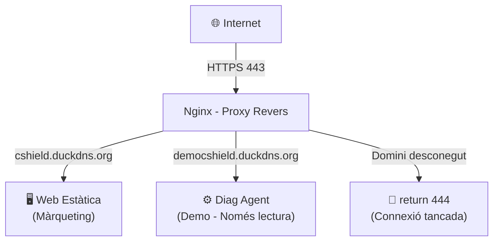
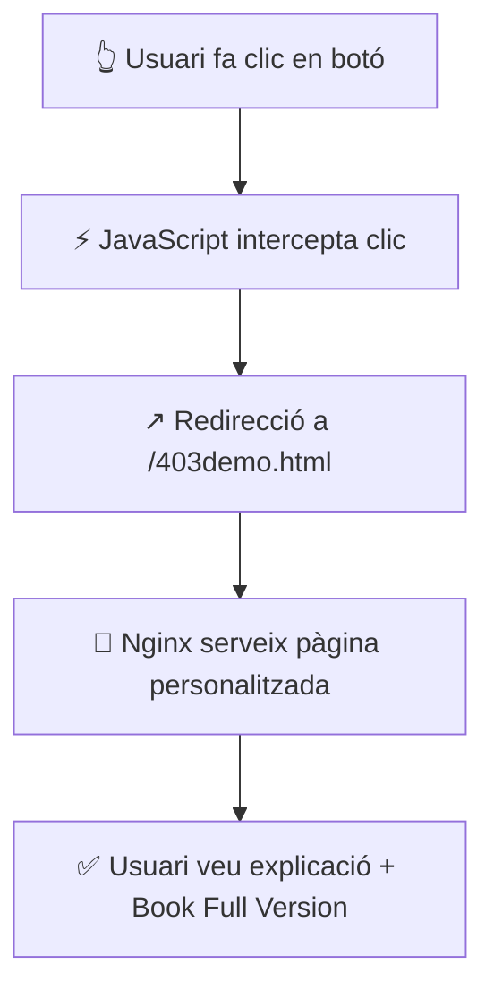
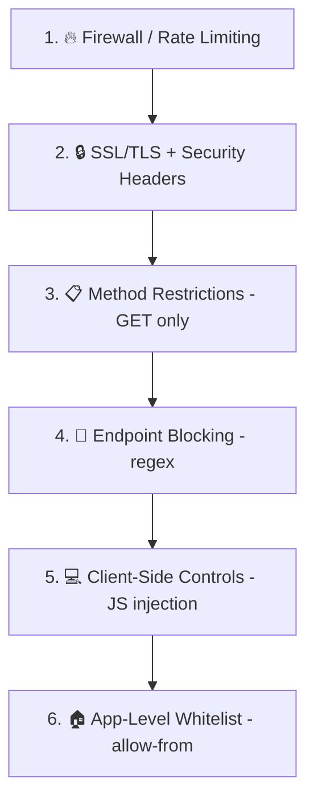

# Documentació del Proxy Revers Nginx - Cybershield Solutions

**Data:** 18 de febrer de 2026
**Versió:** 2.0
**Estat:** Producció

---

## Taula de Continguts

1. [Introducció](#introduccio)
2. [Arquitectura del Sistema](#arquitectura-del-sistema)
3. [Configuració de Nginx](#configuracio-de-nginx)
4. [Seguretat Implementada](#seguretat-implementada)
5. [Gestió del Mode Demo](#gestio-del-mode-demo)
6. [Manteniment i Operacions](#manteniment-i-operacions)

---

## Introducció

Aquest document descriu la configuració del proxy revers Nginx per a la plataforma Cybershield Solutions. El proxy revers permet exposar l'aplicació `diag_agent` a Internet de manera segura, proporcionant:

- **Terminació SSL** amb certificats Let's Encrypt
- **Restricció d'accés** en mode demo (només lectura)
- **Pàgina d'error personalitzada** per a les accions bloquejades
- **Separació clara** entre lloc web principal i demo

### Components Principals



### Dominis Actius

| Domini | Propòsit | SSL | Estat |
|--------|----------|-----|-------|
| `cshield.duckdns.org` | Lloc web principal de màrqueting | ✅ | ✅ Actiu |
| `democshield.duckdns.org` | Demo de l'aplicació Diag Agent | ✅ | ✅ Actiu |
| `demo.cshield.duckdns.org` | - | ❌ | ❌ Eliminat |

---

## Arquitectura del Sistema

### Ubicacions dels Fitxers

| Component | Ruta | Descripció |
|-----------|------|------------|
| Diag Agent | `/home/grup1/scripts/diag_agent_single.py` | Aplicació Flask principal |
| Web Estàtica | `/var/www/cybershield/` | Lloc web de màrqueting |
| Pàgina 403 | `/var/www/cybershield/403demo.html` | Pàgina d'error demo |
| Config Nginx | `/etc/nginx/sites-available/` | Configuracions dels llocs |
| Config Enabled | `/etc/nginx/sites-enabled/` | Llocs activats |
| SSL Certs | `/etc/letsencrypt/live/` | Certificats SSL |

### Certificats SSL

| Certificat | Domains | Caducitat |
|------------|---------|-----------|
| `cshield.duckdns.org` | `cshield.duckdns.org` | 9 Abr 2026 |
| `democshield.duckdns.org` | `democshield.duckdns.org` | 18 Mai 2026 |

### Aplicació Diag Agent

L'aplicació Flask s'executa a:
- **Host:** 192.168.1.72
- **Port:** 8080
- **Xarxa permesa:** 192.168.1.0/24

```bash
/home/grup1/scripts/diag_agent_single.py \
  --host 192.168.1.72 \
  --port 8080 \
  --allow-from 192.168.1.0/24
```

### Rutes de l'Aplicació (Demo)

| Ruta | Visualització | Accions |
|------|---------------|---------|
| `/` | ✅ Permes | ❌ Bloquejat |
| `/vulns` | ✅ Permes | ❌ Bloquejat |
| `/packages` | ✅ Permes | ❌ Bloquejat |
| `/services` | ✅ Permes | ❌ Bloquejat |
| `/logs` | ✅ Permes | ❌ Bloquejat |
| `/report` | ✅ Permes | ❌ Bloquejat |
| `/soc` | ✅ Permes | ⚠️ Només lectura (sense block IPs) |
| `/pentest` | ❌ Bloquejat | ❌ Bloquejat |
| `/shodan` | ❌ Bloquejat | ❌ Bloquejat |
| `/harvester` | ❌ Bloquejat | ❌ Bloquejat |

**Totes les APIs (`/api/*`) estan bloquejades en mode demo.**

---

## Configuració de Nginx

### Configuració Principal

**Fitxer:** `/etc/nginx/nginx.conf`

```nginx
user www-data;
worker_processes auto;
pid /run/nginx.pid;
error_log /var/log/nginx/error.log;

events {
    worker_connections 768;
}

http {
    sendfile on;
    tcp_nopush on;
    types_hash_max_size 2048;
    server_tokens off;

    # SSL Settings
    ssl_protocols TLSv1.2 TLSv1.3;
    ssl_prefer_server_ciphers on;

    # Rate Limiting Zone
    limit_req_zone $binary_remote_addr zone=one:10m rate=60r/m;

    # Virtual Host Configs
    include /etc/nginx/conf.d/*.conf;
    include /etc/nginx/sites-enabled/*;
}
```

**Elements clau:**
- `server_tokens off;` - Amaga la versió de Nginx
- `ssl_protocols TLSv1.2 TLSv1.3;` - Només protocols segurs
- `limit_req_zone` - Limitació de velocitat global (60 peticions/minut)

### Lloc Principal: cshield

**Fitxer:** `/etc/nginx/sites-available/cshield`

Aquesta configuració serveix el lloc web principal de màrqueting (estàtic).

```nginx
# --- Catch-all per a dominis desconeguts ---
server {
    listen 80 default_server;
    server_name _;
    return 444;
}

server {
    listen 443 ssl http2 default_server;
    server_name _;

    ssl_certificate     /etc/letsencrypt/live/cshield.duckdns.org/fullchain.pem;
    ssl_certificate_key /etc/letsencrypt/live/cshield.duckdns.org/privkey.pem;

    return 444;
}

# --- Redirecció HTTP a HTTPS ---
server {
    listen 80;
    server_name cshield.duckdns.org;
    return 301 https://$host$request_uri;
}

# --- Servidor HTTPS (Lloc Principal) ---
server {
    listen 443 ssl http2;
    server_name cshield.duckdns.org;

    root /var/www/cybershield;
    index index.html;

    # Certificats SSL
    ssl_certificate     /etc/letsencrypt/live/cshield.duckdns.org/fullchain.pem;
    ssl_certificate_key /etc/letsencrypt/live/cshield.duckdns.org/privkey.pem;
    ssl_trusted_certificate /etc/letsencrypt/live/cshield.duckdns.org/fullchain.pem;

    ssl_dhparam /etc/ssl/certs/dhparam.pem;

    ssl_protocols TLSv1.2 TLSv1.3;
    ssl_ciphers 'ECDHE-ECDSA-AES256-GCM-SHA384:ECDHE-ECDSA-CHACHA20-POLY1305:ECDHE-ECDSA-AES128-GCM-SHA256';
    ssl_prefer_server_ciphers on;

    # Security Headers
    add_header Strict-Transport-Security "max-age=31536000" always;
    add_header X-Content-Type-Options nosniff always;
    add_header X-Frame-Options SAMEORIGIN always;
    add_header Referrer-Policy no-referrer-when-downgrade always;
    add_header Permissions-Policy "geolocation=(), microphone=(), camera=()" always;
    add_header Content-Security-Policy "default-src 'self'; ..." always;

    # Cache per a fitxers estàtics
    location ~* \.(css|js|png|jpe?g|gif|svg|ico|woff2?)$ {
        expires 7d;
        add_header Cache-Control "public, max-age=604800, immutable";
        access_log off;
    }

    # Lloc web principal - fitxers estàtics
    location / {
        try_files $uri $uri/ =404;
    }
}
```

### Demo: democshield

**Fitxer:** `/etc/nginx/sites-available/democshield`

Aquesta configuració fa proxy a l'aplicació Diag Agent amb restriccions de demo.

```nginx
# --- Redirecció HTTP a HTTPS ---
server {
    listen 80;
    server_name democshield.duckdns.org;
    return 301 https://$host$request_uri;
}

# --- Servidor HTTPS (Demo App) ---
server {
    listen 443 ssl http2;
    server_name democshield.duckdns.org;

    root /var/www/cybershield;

    # Pàgina 403 personalitzada
    error_page 403 /403demo.html;
    location = /403demo.html {
        root /var/www/cybershield;
    }

    # Certificats SSL
    ssl_certificate     /etc/letsencrypt/live/democshield.duckdns.org/fullchain.pem;
    ssl_certificate_key /etc/letsencrypt/live/democshield.duckdns.org/privkey.pem;
    ssl_trusted_certificate /etc/letsencrypt/live/democshield.duckdns.org/fullchain.pem;

    ssl_dhparam /etc/ssl/certs/dhparam.pem;

    ssl_protocols TLSv1.2 TLSv1.3;
    ssl_ciphers 'ECDHE-ECDSA-AES256-GCM-SHA384:ECDHE-ECDSA-CHACHA20-POLY1305:ECDHE-ECDSA-AES128-GCM-SHA256';
    ssl_prefer_server_ciphers on;

    add_header Strict-Transport-Security "max-age=31536000" always;

    # Bloc de IPs de SOC (perillós)
    location ~* ^/api/soc/(block|unblock)-ip {
        deny all;
    }

    # Bloc d'APIs perilloses (permet /api/soc/* per a mètriques)
    location ~* ^/(api/(?!soc/)|run_|pentest/) {
        deny all;
    }

    # Proxy global
    location / {
        # Blocar /report amb paràmetres
        if ($args ~ ".+") {
            set $block_report 1;
        }
        if ($uri ~ "^/report$") {
            set $block_report "${block_report}1";
        }
        if ($block_report = "11") {
            return 403;
        }

        # Rate limiting
        limit_req zone=one burst=20 nodelay;

        # Només permetre GET (només lectura)
        limit_except GET {
            deny all;
        }

        # Proxy a Diag Agent
        proxy_pass http://192.168.1.72:8080;
        proxy_http_version 1.1;

        # Injectar JavaScript de control
        sub_filter '</head>' '<script>fetch=window.fetch;window.fetch=function(...a){return fetch(...a).then(r=>{if(r.status===403)window.location.href="/403demo.html";return r;}).catch(e=>{throw e;});};const _XHR=window.XMLHttpRequest;window.XMLHttpRequest=function(){const x=new _XHR();x.addEventListener("readystatechange",function(){if(x.readyState===4&&x.status===403)window.location.href="/403demo.html";});return x;};document.addEventListener("DOMContentLoaded",function(){document.querySelectorAll("button").forEach(b=>{if(b.textContent.includes("Book")||b.textContent.includes("Contact")||b.textContent.includes("Go Back"))return;b.addEventListener("click",function(e){e.preventDefault();e.stopPropagation();window.location.href="/403demo.html";});});document.querySelectorAll("form").forEach(f=>{f.addEventListener("submit",function(e){e.preventDefault();e.stopPropagation();window.location.href="/403demo.html";});});});window.sendAIMessage=window.sendChatMessage=function(){const chatDiv=document.getElementById("ai-chat-messages");if(chatDiv){const msg=document.createElement("div");msg.className="ai-message assistant";msg.innerHTML="<div><strong>🔒 AI Assistant - Demo Mode</strong><br><br>Sorry, the AI-powered security analysis and chat features are not available in demo mode.<br><br>To experience the full AI capabilities including:<br>• Intelligent vulnerability analysis<br>• Natural language security queries<br>• Automated threat detection<br>• Smart recommendations<br><br>Please <a href=\\"https://cshield.duckdns.org/#contacte\\">contact us</a> to book the full version!</div><div class=\\"timestamp\\">"+new Date().toLocaleTimeString([],{hour:"2-digit",minute:"2-digit"})+"</div>";chatDiv.appendChild(msg);chatDiv.scrollTop=chatDiv.scrollHeight;}};</script></head>';
        sub_filter_once off;

        proxy_set_header Host $host;
        proxy_set_header X-Real-IP $remote_addr;
        proxy_set_header X-Forwarded-For $proxy_add_x_forwarded_for;
        proxy_set_header X-Forwarded-Proto $scheme;
        proxy_set_header Accept-Encoding "";

        proxy_read_timeout 60s;
        proxy_connect_timeout 30s;
    }
}
```

### Bloc de Dominis Desconeguts

El servidor `default_server` bloqueja qualsevol domini no configurat:

```nginx
server {
    listen 443 ssl http2 default_server;
    server_name _;

    ssl_certificate     /etc/letsencrypt/live/cshield.duckdns.org/fullchain.pem;
    ssl_certificate_key /etc/letsencrypt/live/cshield.duckdns.org/privkey.pem;

    return 444;  # Tanca la connexió sense resposta
}
```

**`return 444`** fa que nginx tanqui la connexió immediatament sense enviar cap resposta. El navegador mostrarà "No s'ha pogut connectar" o similar.

---

## Seguretat Implementada

### 1. Terminació SSL/TLS

**Protocols suportats:** TLSv1.2, TLSv1.3
**Xifrats:** ECDHE-ECDSA amb GCM i ChaCha20-Poly1305

### 2. Capçaleres de Seguretat

| Capçalera | Valor | Propòsit |
|-----------|-------|----------|
| `Strict-Transport-Security` | `max-age=31536000` | Força HTTPS per 1 any |
| `X-Content-Type-Options` | `nosniff` | Prevé MIME-sniffing |
| `X-Frame-Options` | `SAMEORIGIN` | Prevé clickjacking |
| `Referrer-Policy` | `no-referrer-when-downgrade` | Controla referrer info |
| `Permissions-Policy` | `geolocation=(), microphone=(), camera=()` | Bloqueja sensors |
| `Content-Security-Policy` | `default-src 'self'...` | Controla recursos |

### 3. Limitació de Velocitat (Rate Limiting)

```nginx
# Definició global
limit_req_zone $binary_remote_addr zone=one:10m rate=60r/m;

# Ús en demo
limit_req zone=one burst=20 nodelay;
```

**Configuració:**
- **Taxa:** 60 peticions per minut
- **Burst:** 20 peticions addicionals (demo)

### 4. Restricció de Mètodes HTTP

```nginx
limit_except GET {
    deny all;
}
```

**Permet:** Només GET (visualització)
**Bloqueja:** POST, PUT, DELETE, PATCH, etc.

### 5. Bloqueig d'Endpoints Perillosos

#### Bloc d'APIs Generals
```nginx
location ~* ^/(api/(?!soc/)|run_|pentest/) {
    deny all;
}
```

**Expressió regular:**
- `api/(?!soc/)` - Bloqueja `/api/*` excepte `/api/soc/*` (mètriques)
- `run_` - Bloqueja totes les rutes que comencen per `run_`
- `pentest/` - Bloqueja `/pentest/*`

#### Bloc d'IPs de SOC
```nginx
location ~* ^/api/soc/(block|unblock)-ip {
    deny all;
}
```

**Bloqueja específicament:**
- `/api/soc/block-ip` - Bloquejar IPs amb iptables
- `/api/soc/unblock-ip` - Desbloquejar IPs

### 6. Injecció de JavaScript de Control

El proxy injecta JavaScript automàticament per:

#### Intercepció d'Errors 403
```javascript
// Redirect en rebre 403
fetch = window.fetch;
window.fetch = function(...args) {
    return fetch(...args).then(response => {
        if (response.status === 403) {
            window.location.href = "/403demo.html";
        }
        return response;
    });
};
```

#### Desactivació de Tots els Botons
```javascript
// Intercepta tots els clics de botons
document.querySelectorAll("button").forEach(button => {
    button.addEventListener("click", function(event) {
        event.preventDefault();
        window.location.href = "/403demo.html";
    });
});
```

#### Override del Chat AI
```javascript
// Mostra missatge de demo en lloc de IA real
window.sendAIMessage = function() {
    // Mostra missatge: "🔒 AI Assistant - Demo Mode"
    // "No disponible en demo, contacti per a la versió completa"
};
```

---

## Gestió del Mode Demo

### Funcionalitats Permeses

| Acció | Estat |
|-------|-------|
| Navegar totes les pàgines | ✅ Permes |
| Veure dades existents | ✅ Permes |
| Veure mètriques SOC | ✅ Permes |
| Utilitzar navegació | ✅ Permes |
| Accedir via URL directe | ✅ Permes |

### Funcionalitats Bloquejades

| Acció | Mètode de Bloqueig |
|-------|-------------------|
| Generar reports (PDF/CSV) | `limit_except GET` |
| Descarregar arxius | `limit_except GET` |
| Executar escaneigs (APIs) | Bloqueig d'APIs |
| Bloquejar IPs (SOC) | Regex específic |
| Pentesting | Regex `pentest/` |
| Xat AI | Override JavaScript |
| Qualsevol botó d'acció | Event listener global |

### Flux de Redirecció



---

## Manteniment i Operacions

### Ordres de Nginx

```bash
# Estat del servei
sudo systemctl status nginx

# Recarregar configuració (sense temps d'inactivitat)
sudo systemctl reload nginx

# Provar configuració
sudo nginx -t

# Veure registres
sudo tail -f /var/log/nginx/access.log
sudo tail -f /var/log/nginx/error.log
```

### Actualitzar Certificats SSL

```bash
# Certbot renova automàticament
sudo certbot renew --dry-run  # Provar
sudo certbot renew --force-renewal  # Forçar
```

### Provar el Proxy

```bash
# Provar lloc principal
curl -I https://cshield.duckdns.org

# Provar demo
curl -I https://democshield.duckdns.org

# Provar API (hauria de donar 403)
curl -X POST https://democshield.duckdns.org/api/status

# Provar domini desconegut (hauria de fallar)
curl -I https://demo.cshield.duckdns.org
```

### Supervisió

```bash
# Connexions actives
sudo netstat -an | grep :443 | wc -l

# Errors 403
sudo grep " 403 " /var/log/nginx/access.log | tail -20

# IPs amb moltes peticions
sudo awk '{print $1}' /var/log/nginx/access.log | sort | uniq -c | sort -rn | head -20
```

### Resolució de Problemes

#### Pàgina 403 no es mostra

```bash
# Verificar fitxer
ls -la /var/www/cybershield/403demo.html

# Verificar permisos
chmod 644 /var/www/cybershield/403demo.html
```

#### Dominis desconeguts encara responen

```bash
# Verificar que default_server està primer
sudo nginx -T | grep -A 5 "default_server"
```

#### Rate limiting massa agressiu

```nginx
# Augmentar burst o taxa
limit_req zone=one burst=30 nodelay;
```

---

## Resum de Seguretat

### Nivell de Protecció

| Capa | Mesura | Estat |
|------|--------|-------|
| Xarxa | Rate limiting + default_server reject | ✅ Actiu |
| Transport | SSL/TLS 1.2-1.3 | ✅ Actiu |
| Aplicació | Restricció de mètodes (GET only) | ✅ Actiu |
| API | Bloqueig d'endpoints | ✅ Actiu |
| Client | Desactivació JavaScript | ✅ Actiu |
| Contingut | CSP i security headers | ✅ Actiu |

### Model de Seguretat Defense-in-Depth



---

## Documentació Addicional

- **Diag Agent:** `/home/grup1/scripts/README.md`
- **Arquitectura:** `/home/grup1/claudio/ARCHITECTURE_DOCUMENTATION.md`

---

**Document creat per:** Claude Code
**Data de creació:** 18 de febrer de 2026
**Última actualització:** 18 de febrer de 2026
**Versió:** 2.0 (Configuració neta)
